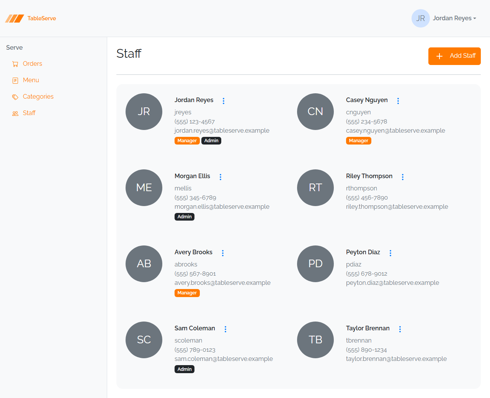

# Lesson 1 Lab — Style a Staff Card by hand

Build a TableServe **Staff card** in plain HTML and CSS — same tools as the guide (two
files, no framework), a different entity. A Staff card is an identity block just like
the Menu Item card, so the same box-model and `display` techniques apply. Refer back
to the guide for the card, box model, and `display` details.

Here's the end goal — the finished TableServe Staff page. You're hand-building **one
card** from this grid; you'll rebuild it with Bootstrap in Lesson 4 and assemble the
full wrapping grid then.

---

## The Staff record

A staff member has: **First Name**, **Last Name**, **Username**, **Phone**, **Email**,
and a **role** (Manager, Admin, or neither). Pick one staff member and hardcode their
values — e.g. Jordan Reyes, jreyes, (555) 123-4567, jordan@tableserve.test, Manager.

---

## Steps

1. In your `css-fundamentals/` folder, create `staff-card.html` (Emmet `!` + Tab, then
   `link:css`) and (reuse or create) a `staff.css`, linked from the HTML `<head>`. Open
   it with **Live Server**.
2. Add `* { box-sizing: border-box; }` and a little `body` padding to the CSS.
3. Mark up the card with a `
` (Emmet: type `div.card` + Tab)
   holding:
   - a `.name` span — first + last name
   - `.username`, `.phone`, `.email` spans — the contact lines
   - a `.badge` span — the role (e.g. "Manager")
4. Style `.card` as a box: a fixed `width` (~`22rem`), `padding`, `border`,
   `border-radius`, and a soft `box-shadow`.
5. Make `.name` a **block** span, larger and heavier (`font-size`, `font-weight`).
6. Make the contact spans **block** and muted (`color: #6c757d`, smaller
   `font-size`); add a small `margin-bottom` between lines.
7. Make `.badge` an **inline-block** pill — `padding`, a `background-color`, a text
   `color`, and `border-radius` (use a distinct color from the Menu badge, e.g. a
   green for Manager).

---

## Verify in the browser

Browser checks work the same as the guide — section 9. With `staff-card.html` open in
Live Server:

1. Confirm the card renders as a bordered, rounded, padded box with the name on top,
   muted contact lines stacked below, and a colored role pill.
2. Open **DevTools** (F12) → **Elements**, select `.card`, and read the box-model
   overlay — confirm your `padding` and `margin` values match the CSS.
3. Select `.badge` and confirm it's `inline-block` (its `width` hugs the text and its
   padding renders).
4. Check the **Console** for a failed stylesheet load if nothing is styled.

Same box-model card, a different entity — exactly the muscle you'll reuse when you
rebuild these cards with Bootstrap in Lesson 4, and again on PRS's **Users** cards in
the capstone.

---

## Stretch challenges

Optional — for when you finish early. Not needed for the capstone.
**[Reinforce]** builds on what you just did; **[Reach]** goes past the guide and
needs some research.

- **Two role badges** — [Reinforce] — for a staff member who is both Manager *and*
  Admin, render two `.badge` pills side by side. Because they're `inline-block`,
  they'll sit next to each other — add a small `margin-right` so they don't touch.
- **Hover lift** — [Reinforce] — add a `.card:hover` rule that deepens the
  `box-shadow` (and optionally nudges the card up with `margin-top`), so the card
  reacts to the mouse. Reload and hover to confirm.
- **A card of your own restaurant's staff** — [Reinforce] — duplicate the card and
  fill it with a real (or made-up) coworker, proving you can reproduce the structure
  from memory.
- **Avatar circle with initials** — [Reach] — add a circular avatar showing the
  member's initials (e.g. "JR") at the top of the card. A circle is just a box with
  equal `width`/`height` and `border-radius: 50%`, with the initials centered inside.
  This pattern **isn't spelled out** on purpose — you'll want it again on PRS's Users
  cards. Reference:
  [border-radius (MDN)](https://developer.mozilla.org/en-US/docs/Web/CSS/border-radius).

Finished these and want more? See
[stretch-html-css-challenges.md](stretch-html-css-challenges.md) for bigger
challenges that span the whole HTML/CSS pass.
