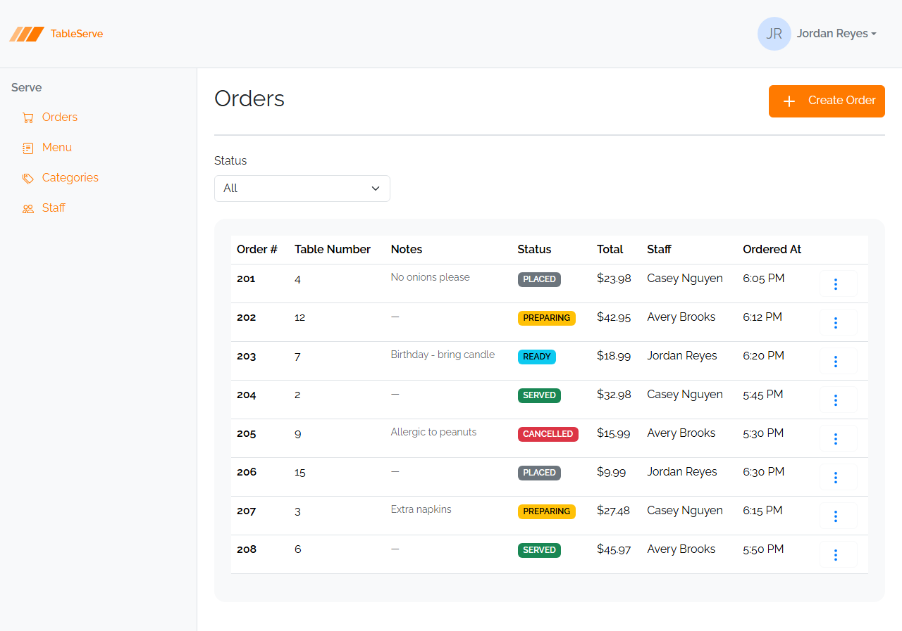
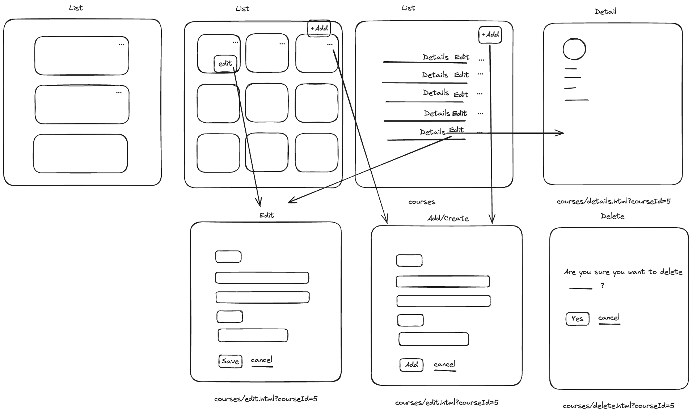

# Lesson 3 Guide — The Vite Scaffold, Partials, and the Bootstrap Page Shell

**Goal:** by the end of this lesson you have the TableServe static-design project
running with `npm run dev`, you understand the page shell every screen shares
(header → nav → content), and you have built the first **page skeleton** — the
Orders page. This is where the project **tooling** (Vite + Handlebars partials) and
**Bootstrap** enter. No Bootstrap components yet (cards, tables, forms come next
lesson) — this lesson is about the layout scaffold every page sits inside.

**The general pattern you're learning:** every page in this app is the same three
regions — a shared `header`, a shared `nav` sidebar, and a page-specific
`section.content` — laid out with **flexbox**, never the Bootstrap `row`/`col` grid.
And Bootstrap's **utility classes are just shorthand for the raw CSS you already
wrote by hand in Lessons 1–2** — `d-flex` is `display: flex`, `p-4` is padding, and
so on. Once you can produce the shell, every other page is different content dropped
into the same frame.

> **How to use this guide.** Sections marked **▶ Code along** are hands-on — build them
> into your `TableServe.Design` project as you read. The unmarked sections are concepts
> and reference to read first, then apply in the code-along sections and the lab. (Emmet
> abbreviations from Lessons 1–2 still speed up typing the markup.)

---

**End goal — where you're headed.** This is the finished **Orders** page:



In *this* lesson you build only its **frame** — the header, the nav, and the heading
row — and leave the area below empty. Lesson 4 fills in the filter and table; Lesson 5
adds the modals. Every page in the app is this same shell wrapped around different
content.

---

## 1. Where this lesson fits

In **Lessons 1 and 2** you wrote HTML and CSS **by hand** in plain files — the box
model, semantic tags, and flexbox, styled with your own CSS in a `.css` file you
linked yourself. You previewed those files with Live Server. No framework, no build
tooling, on purpose: you needed to see the raw mechanics before anything hid them.

Now you add the two things a real project uses to avoid repeating that work:

- **Bootstrap** — a CSS framework that ships thousands of pre-written classes so you
  *don't* hand-write `display: flex; justify-content: space-between;` every time.
- **Vite + a partials plugin** — a dev server plus a way to write the shared header
  and nav **once** and include them on every page.

Nothing here replaces what you learned — Bootstrap's classes *are* that CSS, named
and packaged. This lesson shows you the packaging.

```
Lessons 1–2            →  Lesson 3 (you are here)   →  Lessons 4–5
raw HTML/CSS/flexbox      tooling + Bootstrap shell     Bootstrap components
by hand, plain files      the frame every page shares   cards, tables, forms, modals
```

### Why the whole pass comes before React

You already built the TableServe **Web API**. In this pass you build the **static
front end** — markup styled with Bootstrap, with **no JavaScript logic** of your own
(only Bootstrap's bundle for dropdowns and modals). No data fetching, no forms that
submit, no routing. You get the **markup and layout** exactly right while it's still
simple; in the React pass you convert this same markup into components. Think of
these pages as the visual target React has to reproduce.

### The pages you'll build

Every screen in this app is one of a handful of **page types** — a list (as a card grid
or a table), a detail view, a shared create/edit form, and a delete confirmation — wired
together by navigation. Here's the whole map:



You'll skeleton these page types in this lesson's lab, then fill them with real Bootstrap
components in Lessons 4–5 — the same handful of pages you'll rebuild for PRS in the
capstone.

---

## 2. The project scaffold (provided)

You're given a starter project — you don't build the tooling from scratch. Download
and unzip [`tableserve-design-starter.zip`](https://github.com/craigmckeachie/academy-resources/raw/main/files/tableserve-design-starter.zip);
the unzipped folder is your project, and inside you'll find:

```
TableServe.Design/
  package.json          ← dependencies + dev/build scripts
  vite.config.js        ← Vite + handlebars partials config (every page already wired)
  index.html            ← page directory — links to every page in the project
  orders.html           ← ships BLANK (just the <head>) — you build its shell in
                            this lesson's guide
  staff.html            ← ships BLANK — you build its shell in this lesson's lab
  menuitems.html        ← skeleton: the shared shell (header + nav + empty content)
  categories.html         is already in place, ready to fill in
  order-create.html       (…and the rest — see index.html for the full list)
  …
  partials/
    header.html         ← finished — the top bar + brand + user menu
    nav.html            ← finished — the left sidebar links
  css/
    styles.css          ← finished — fonts, brand color, layout tweaks
  assets/
    bootstrap-icons.svg  ← the icon sprite used with <use href="...#icon">
  node_modules/         ← after you run npm install
```

The `header.html`, `nav.html`, `styles.css`, and `assets/` are **finished for you**.
**Most** entity pages also ship as a **skeleton** — the shared shell wrapped around an
empty `section.content`, ready for you to fill in. Two are the exception: `orders.html`
and `staff.html` ship **blank** (just the `<head>`) on purpose, because in this lesson
you build their shell yourself — `orders.html` in the guide below, `staff.html` in the
lab. Every other page you *open and fill*, not create.

### package.json

```json
{
  "name": "tableserve-design",
  "private": true,
  "type": "module",
  "scripts": {
    "dev": "vite",
    "build": "vite build"
  },
  "dependencies": {
    "bootstrap": "^5.3.3"
  },
  "devDependencies": {
    "vite": "^5.2.0",
    "vite-plugin-handlebars": "^2.0.0"
  }
}
```

Three packages, that's it:
- **bootstrap** — the CSS framework (installed via npm, **not** a CDN `<link>`).
- **vite** — the dev server. It serves your pages with instant reload as you save.
- **vite-plugin-handlebars** — lets you write `{{> header}}` in a page and have the
  contents of `partials/header.html` dropped in. That's how every page shares one
  header and one nav without copy-pasting them.

Run `npm install` once to create `node_modules/`, then `npm run dev`. Vite prints a
local URL (e.g. `http://localhost:5173`). Leave it running — it reloads on save.

> **What changed from Lessons 1–2:** there you previewed a `.html` file with **Live
> Server**. Now you run **Vite's** dev server (`npm run dev`) and open the URL it prints
> — because the `{{> header}}` partials only expand when Vite processes the page.

---

## 3. Partials — write the header and nav once

Without partials, changing a nav link would mean editing every page. Instead, each
page includes the shared pieces with a Handlebars **partial** tag:

```html
{{> header}}   ← inserts partials/header.html
{{> nav}}      ← inserts partials/nav.html
```

`vite.config.js` wires this up by pointing the plugin at the `partials/` folder:

```js
import { defineConfig } from "vite";
import handlebars from "vite-plugin-handlebars";
import { resolve } from "path";

export default defineConfig({
  plugins: [
    handlebars({
      partialDirectory: resolve(__dirname, "partials"),
    }),
  ],
  build: {
    rollupOptions: {
      input: {
        // one entry per page so `npm run build` produces every page
        orders: resolve(__dirname, "orders.html"),
        // ...one line per .html page you add
      },
    },
  },
});
```

Every page the starter ships already has its line in that `input` object — you don't
add entries for the provided pages. You only add one line here if you create a
**brand-new page** of your own (say, in a stretch challenge) so the production build
knows about it. During `npm run dev` you can open any `.html` file directly.

You don't need to edit `header.html` or `nav.html` — they're done. It's still worth
reading them so you recognize the pieces (the brand SVG logo, the user dropdown, the
nav-pills sidebar links).

---

## 4. Semantic HTML in the shell (a quick recap)

You met **semantic tags** in Lesson 1 — tags that describe what a region *is*, not
just how it looks. The shell is built entirely from them, so a quick recap of the
ones you'll see:

| Tag | Meaning |
|---|---|
| `<header>` | page banner (the top bar) |
| `<nav>` | primary navigation (the sidebar) |
| `<main>` | the one main content area of the page |
| `<section>` | a thematic grouping (the page's content region) |

Same rules as Lesson 1: exactly **one `<main>`** per page, reach for a `<div>` only
when no semantic tag fits (a pure layout wrapper), and pick heading levels by rank
(`<h2>` page title, `<h5>` card title) not by size.

---

## 5. Bootstrap utility classes = the CSS you already know, abbreviated

Here's the mental model that keeps Bootstrap from feeling like magic: **a utility
class is one line of the CSS you hand-wrote in Lessons 1–2, given a short name.**
When you write `class="d-flex"`, Bootstrap's stylesheet has literally already
written `.d-flex { display: flex; }` for you. You're not learning new *concepts* —
you already know the box model and flexbox — you're learning the *names*.

**Box-model utilities** — the padding/margin you set by hand, on a 0–5 scale:

| Class | The CSS you'd have written |
|---|---|
| `p-4` | `padding: 1.5rem;` (all sides) |
| `py-4` | `padding-top` **and** `padding-bottom` |
| `px-4` | `padding-left` **and** `padding-right` |
| `mb-4` | `margin-bottom: 1.5rem;` |
| `me-2` | `margin-right: 0.5rem;` (margin-**end**, left-to-right) |
| `border-bottom border-2` | `border-bottom: 2px solid;` |

**Flexbox utilities** — the exact flexbox properties from Lesson 2:

| Class | The CSS you'd have written |
|---|---|
| `d-flex` | `display: flex;` |
| `flex-row` | `flex-direction: row;` |
| `flex-column` | `flex-direction: column;` |
| `flex-wrap` | `flex-wrap: wrap;` |
| `justify-content-between` | `justify-content: space-between;` |
| `justify-content-end` | `justify-content: flex-end;` |
| `align-items-center` | `align-items: center;` |
| `gap-4` | `gap: 1.5rem;` |
| `flex-grow-1` | `flex-grow: 1;` |

Because the classes are just that CSS, you'll rarely open a `.css` file this pass —
`styles.css` only adds the handful of brand rules Bootstrap can't express. When a
utility doesn't cover something cleanly, you drop back to an inline `style="..."` or
a `styles.css` rule — exactly the CSS you already write.

### The one layout rule for the whole course

**We lay out with flexbox utilities, never Bootstrap's `row`/`col` grid.** If you
catch yourself typing `class="row"` or `class="col-6"`, stop — that's the wrong tool
here. Everything you need, you built by hand in Lesson 2; the utilities above are the
same thing named.

Two patterns you'll use on nearly every page — the same two you hand-built in
Lesson 2, now in utilities:

**A header row with a title on the left and a button on the right:**
```html
<div class="d-flex justify-content-between align-items-center">
  <h2>Orders</h2>
  <a href="/order-create.html" class="btn btn-primary">Create Order</a>
</div>
```
`justify-content-between` puts maximum space between the two children, pinning one to
each end.

**A sidebar next to a content area that fills the rest:**
```html
<main class="d-flex">
  {{> nav}}                          <!-- fixed 280px sidebar -->
  <section class="content flex-grow-1">...</section>  <!-- eats the rest -->
</main>
```
`d-flex` makes `main` a row; `flex-grow-1` on the content lets it expand to fill
whatever the fixed-width nav doesn't use. That's the whole app frame — the one you
built by hand in Lesson 2, now assembled from the scaffold's partials.

### Proof: it's just CSS someone wrote for you

The tables above *claim* `d-flex` is only `display: flex`. Don't take it on faith —
Bootstrap ships its full, **unminified** stylesheet right next to the one you link, at
`node_modules/bootstrap/dist/css/bootstrap.css` (the `.css`, not the `.min.css`). It's
plain CSS you can read.

Prove it two ways on your Orders skeleton:

1. **Read the source.** Open `node_modules/bootstrap/dist/css/bootstrap.css` and search
   (Ctrl-F) for `.d-flex {` — you'll find exactly `display: flex;`. Search
   `.btn-primary {` and you'll find an ordinary rule (`color`, `background-color`,
   `border`, `padding`) — no magic. Every class you use is in that file.
2. **Inspect and toggle in DevTools.** Open `/orders.html`, right-click the **Create
   Order** button → **Inspect**. The **Styles** pane shows the same `.btn` and
   `.btn-primary` rules Bootstrap wrote. Now **uncheck** its `background-color` — the
   button goes transparent live. Re-check it. Unchecking properties one at a time is the
   fastest way to learn what a class actually does.

This is the whole point of the pass: Bootstrap didn't invent anything you can't read. A
**utility** is one line of CSS; a **component** class (like the `.card` and `.badge` you
meet next lesson) is just *several* of those lines bundled under one name. Same CSS, same
box model from Lesson 1 — you've just stopped typing it yourself. Keep the DevTools Styles
pane open as you build; when a class's effect isn't obvious, uncheck it and watch.

---

## 6. ▶ Code along — the page shell every screen shares

`orders.html` ships **blank** — just the `<head>` and an empty `<body>`. You'll build
that body now: the shell every TableServe page shares. **Open `orders.html`**  in VS Code and type this into the empty
body. You produce it by hand once here — the pre-skeletoned pages already have this exact
structure, so you'll recognize it everywhere:

```html
<!doctype html>
<html lang="en">
  <head>
    <meta charset="UTF-8" />
    <meta name="viewport" content="width=device-width, initial-scale=1.0" />
    <title>TableServe — Orders</title>
    <link rel="stylesheet" href="/node_modules/bootstrap/dist/css/bootstrap.min.css" />
    <link rel="stylesheet" href="/css/styles.css" />
  </head>
  <body>
    {{> header}}
    <main class="d-flex">
      {{> nav}}
      <section class="content p-4 flex-grow-1">
        <!-- page-specific content goes here -->
      </section>
    </main>
    <script src="/node_modules/bootstrap/dist/js/bootstrap.bundle.min.js"></script>
  </body>
</html>
```

Notice:
- Bootstrap's CSS is linked from `node_modules` (installed package), then
  `styles.css` **after** it so our overrides win. (Same idea as Lesson 1, where your
  own `.css` came after any reset — the later rule wins.)
- `{{> header}}` sits above `<main>`; `{{> nav}}` is the first child *inside*
  `<main class="d-flex">`, so it becomes the left column.
- `section.content` gets `p-4` (breathing room) and `flex-grow-1` (fill the rest).
- Bootstrap's **JS bundle** is the last line in `<body>`. It powers the dropdowns
  and modals you'll add later. Every page needs it.

---

## 7. ▶ Code along — the page-heading pattern

Inside `section.content`, every list/detail page opens with the same heading row: a
title on the left, a primary action button on the right, and a bottom border under
both.

```html
<div class="d-flex justify-content-between pb-4 mb-4 border-bottom border-2">
  <h2>Orders</h2>
  <a href="/order-create.html" class="btn btn-primary">
    <svg class="bi pe-none me-2" width="32" height="32" fill="#FFFFFF">
      <use href="/assets/bootstrap-icons.svg#plus" />
    </svg>
    Create Order
  </a>
</div>
```

- `justify-content-between` splits title and button to opposite ends.
- `pb-4 mb-4` — padding then margin below, so the border sits off the text and the
  content below sits off the border. (Recognize the box model from Lesson 1 — padding
  inside, margin outside.)
- `border-bottom border-2` — a 2px rule under the row.
- The **icon** is an SVG `<use>` referencing a symbol in `assets/bootstrap-icons.svg`
  (here `#plus`). `pe-none` makes it ignore pointer events; `me-2` spaces it from the
  label. This same `<svg><use href="...#name" /></svg>` pattern is how every icon in
  the app is drawn.

For this lesson, the content **below** the heading stays empty — a placeholder
comment. Filling it with a card grid or table is next lesson's job. This is a
*skeleton*: shell + heading, nothing more.

---

## 8. Verifying in the browser

Same as Lessons 1–2 — the browser is your verification tool. The one difference from
Lessons 1–2: you open the URL that `npm run dev` prints rather than previewing the file
with Live Server (Vite has to process the page for the `{{> header}}` partials to expand).

1. With `npm run dev` running, open the printed URL and navigate to
   `/orders.html` (or click through from the header brand).
2. You should see: the header bar across the top, the nav sidebar on the left, and
   your "Orders" heading with a "Create Order" button pushed to the right, a rule
   underneath, and empty space below.
3. **Resize the window.** The content area should flex to fill the space beside the
   fixed-width sidebar — that's `flex-grow-1` doing its job (the same behavior you
   built by hand in Lesson 2).
4. Open the browser **DevTools** (F12) → **Elements**, hover over your `<main>`, and
   confirm it's laid out as a flex row (nav + content side by side). Hover the
   heading `<div>` and watch the box-model overlay highlight padding/margin/border —
   the same overlay you used in Lesson 1.
5. Check the **Console** tab for errors. A 404 on `bootstrap.min.css` or
   `styles.css` means a wrong path in your `<link>` tags — fix the href and save.

If the header or nav doesn't appear, the `{{> header}}` / `{{> nav}}` partial isn't
resolving — confirm the file is named exactly `header.html` / `nav.html` in
`partials/`, and that you started the page from `npm run dev` (partials only expand
through Vite, not by opening the raw `.html` file directly).

---

## The General Pattern (what to take away)

Every page you build this pass is the **same shell**:

1. The standard `<head>` (Bootstrap CSS, then `styles.css`).
2. `{{> header}}` for the top bar.
3. `<main class="d-flex">` with `{{> nav}}` as the first child.
4. `<section class="content p-4 flex-grow-1">` for the page's own content.
5. The Bootstrap JS bundle as the last line of `<body>`.
6. Inside content, the `justify-content-between` heading row (title + action + rule).

You lay it all out with **flexbox utilities** — `d-flex`, `justify-content-*`,
`align-items-*`, `gap-*`, `flex-grow-1` — and **never** `row`/`col`. Every one of
those utilities is a line of the CSS you wrote by hand in Lessons 1–2. When you build
the PRS static pages in the capstone, this identical shell is your starting point;
only the page title, the action button, and the content region change.

---

## Build Steps

1. Open the provided `TableServe.Design` scaffold and run `npm install`.
2. Run `npm run dev` and confirm the printed local URL loads — `index.html` is a
   **page directory**, a list of links to every page in the project, so you can
   jump to any page as you build.
3. Read `partials/header.html` and `partials/nav.html` so you recognize the shared
   pieces. Don't change them.
4. Open `orders.html` — click its link on the `index.html` page directory, or open
   the file in VS Code. It ships **blank** (just the `<head>`); build the page shell
   from section 6 into its empty `<body>` — `{{> header}}`, `<main class="d-flex">`
   with `{{> nav}}` and `<section class="content p-4 flex-grow-1">`, and the JS bundle.
5. Add the page-heading row from section 7 inside the existing `section.content` — an
   `<h2>` "Orders" title and a "Create Order" primary button with the `#plus` icon.
6. Leave the area below the heading empty (a placeholder comment) — components come
   next lesson.
7. Confirm `orders` is already listed in the `input` object of `vite.config.js` — every
   starter page is pre-wired, so there's nothing to add here (you'd only add a line for
   a brand-new page of your own).
8. Open `/orders.html` in the browser and verify the shell renders (header, nav,
   heading, rule) using the checks in section 8 — resize to confirm `flex-grow-1`,
   and check the Console for 404s.
