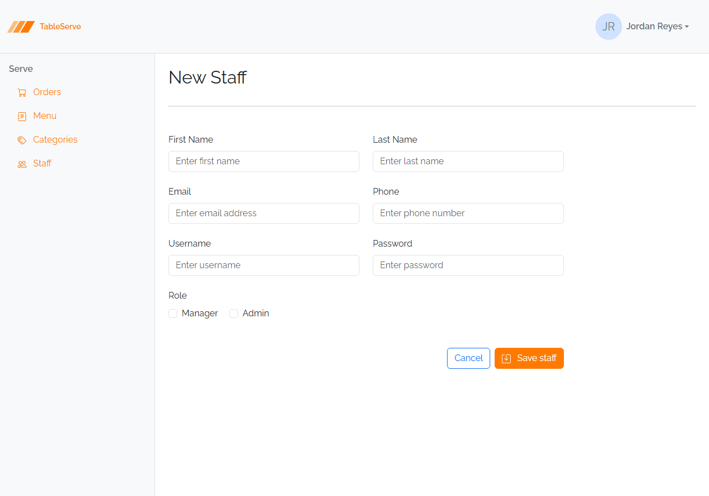

# Lesson 4 Lab — Staff List and Staff Form

Build the **Staff** card grid and the shared **Staff Create/Edit** form, following
the Menu Items patterns from the guide. Staff is a card grid (like Menu Items) but
its form has **no FK dropdown** — instead it has role **checkboxes**. Refer back to
the guide for the card, dropdown, and shared-form markup.

**End goal.** Build toward the finished **Staff** page below. Match the layout by hand
from the guide's card and form patterns — the classes aren't listed here on purpose.

> The **avatar circle with initials** on each card (e.g. "JR") is the optional
> [stretch challenge](#stretch-challenges) below — the base lab's cards don't need it.
> Everything else in the shot is in scope.

---

## The Staff record

Each staff member has: First Name, Last Name, Username, Password, Phone (optional),
Email (optional), and two role flags — **IsManager** and **IsAdmin**.

Hardcode several staff members across the roles: some Managers, some Admins, some
both, some neither.

---

## Part A — `staff.html` (card grid)

1. In your `staff.html` skeleton, add the `.list d-flex flex-row flex-wrap ... gap-5`
   tray (same as Menu Items).
2. Add one card per staff member. Each card shows:
   - First + Last name (`<strong>` inside the card's content `
`)
   - Username, Phone, and Email as muted lines (``)
   - Role **badges** — only when the flag is true:
     `Manager` and/or
     `Admin`
3. Add the 3-dots **dropdown** to each card with **Edit** and **Delete** (Delete
   targets `#deleteStaffModal`, same wiring as Menu Items).

---

## Part B — `staff-create.html` and `staff-edit.html` (shared form)

4. Create `staff-create.html` with a form (`d-flex flex-wrap w-75 gap-2`) laid out in
   flex rows:
   - Row: First Name (`w-50`) + Last Name (`w-50`)
   - Row: Email (`type="email"`, `w-50`) + Phone (`w-50`)
   - Row: Username (`w-50`) + Password (`type="password"`, `w-50`)
   - Row: **Role** — two inline checkboxes using `form-check form-check-inline` with
     `form-check-input` / `form-check-label`, ids `isManager` and `isAdmin`
   - Row: right-aligned Cancel (`<a>` back to `/staff.html`) + Save button (`#save`
     icon)
5. Create `staff-edit.html` as the **same form** with pre-filled `value`s, `checked`
   on the appropriate role checkboxes, and the title "Edit Staff".
6. Confirm `staff`, `staffCreate`, and `staffEdit` are in `vite.config.js`.

> **No FK dropdown here.** Staff has no foreign key, so its form is all plain inputs
> plus checkboxes — simpler than the Menu Item form. On PRS this is exactly the
> **Users** form (also no FK, also role flags).

---

## Verify in the browser

Browser checks are covered in the guide — section 7. With `npm run dev` running:

1. Open `/staff.html` — cards wrap across the page, each showing name, username,
   phone, email, and only the role badges that apply. Role badges should differ per
   member.
2. Open a card's `⋮` menu and confirm Edit/Delete appear.
3. Open `/staff-create.html` — fields paired two-per-row, role checkboxes inline,
   buttons pushed right. Toggle the checkboxes; click labels to focus inputs.
4. Open `/staff-edit.html` — pre-filled values and the correct checkboxes `checked`.
5. Check the Console for 404s.

Same card + shared-form patterns, a different entity — this is precisely how you'll
build the PRS **Users** page and form in the capstone.

---

## Stretch challenges

Optional — for when you finish early. Not needed for the capstone.
**[Reinforce]** builds on what you just did; **[Reach]** goes past the guide and
needs some research.

- **Avatar circle with initials** — [Reach] — give each Staff card a circular avatar
  showing the member's initials (e.g. "JR" for Jordan Reyes) to the left of the
  details, in a `d-flex gap-4` row. This pattern **isn't spelled out in the guide** on
  purpose — work out the circle from a fixed-size flex box that centers its text and
  uses `rounded-circle`. You'll need this exact pattern again on PRS's **Users** cards,
  where it's left for you to solve too. Reference:
  [Bootstrap border-radius utilities (`rounded-circle`)](https://getbootstrap.com/docs/5.3/utilities/borders/).
- **Combined-role styling** — [Reinforce] — for members who are both Manager and
  Admin, confirm both badges render side by side with a small gap. Adjust spacing
  utilities (`me-1`, `mt-1`) so they line up cleanly.
- **Sort the cards** — [Reinforce] — reorder your hardcoded cards so Managers appear
  first, then Admins, then regular staff — practicing that the *order in the markup*
  is the order on screen (React will sort data instead).
- **Empty-optional dashes** — [Reinforce] — for a staff member with no phone or email,
  render an `—` (like the Orders table's empty Notes) instead of a blank line, so the
  card layout stays consistent.

Finished these and want more? See
[stretch-html-css-challenges.md](stretch-html-css-challenges.md) for bigger
challenges that span the whole HTML/CSS pass.
