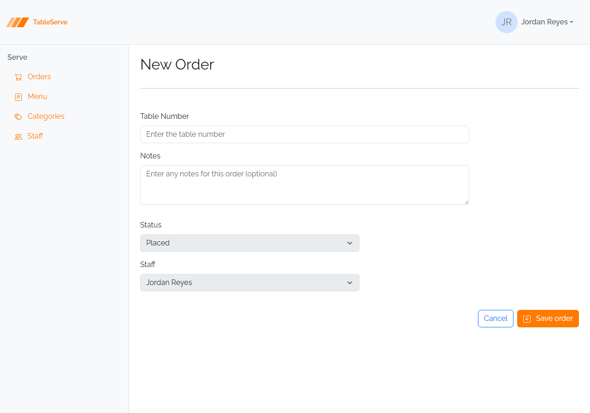
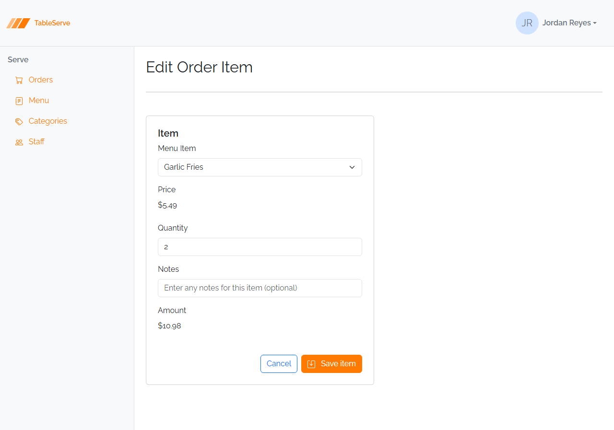
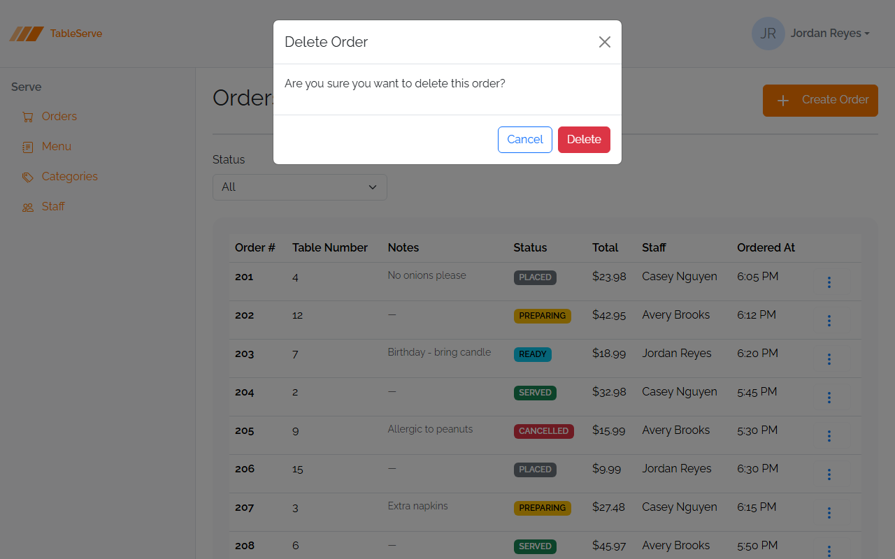

# Lesson 5 Lab — Order Form, Order Item Edit, and Delete Modals

Reinforce the form, nested-form, and modal patterns from the guide by building the
**Order Create/Edit** form, the **Order Item Edit** page, and the **delete
confirmation modals** that your list pages have been pointing at since Lesson 4.
Refer back to the guide for the form and modal markup.

**End goal.** Build toward the finished pages shown under each part below — work out the
classes from the guide's patterns; they're not restated here.

---

## Part A — `order-create.html` and `order-edit.html`

The Order form is a simple **shared form** — no FK dropdown, no derived fields. An
order has just a **Table Number** (required, numeric) and **Notes** (optional).

1. Create `order-create.html` with the standard shell and an "New Order" heading.
2. Add a form (`d-flex flex-wrap w-75 gap-2`) with:
   - Table Number — `<input type="number" class="form-control">` in a `mb-3`
   - Notes — `<textarea class="form-control">` in a `mb-3` (optional)
   - A right-aligned row: Cancel (`<a>` back to `/orders.html`) + Save button (`#save`
     icon)
3. Create `order-edit.html` as the **same form** with pre-filled `value`s (Table
   Number) and text inside the `<textarea>`, titled "Edit Order".

---

## Part B — `orderitem-edit.html`

The guide built `orderitem-create.html`. Build its **edit** twin — same nested child
form, pre-filled.

4. Copy the Order Item form from the guide (Menu Item dropdown, display-only Price,
   Quantity, Notes, display-only Amount).
5. Pre-fill it: mark the ordered menu item's `<option selected>`, show a real Price
   (e.g. `$24.99`), set the Quantity `value`, fill Notes, and show the computed Amount.
6. Title it "Edit Order Item"; keep **Cancel** returning to `/order-detail.html`.

---

## Part C — wire up the delete modals

Your `menuitems.html`, `orders.html`, and `staff.html` pages have Delete links that
`data-bs-target` a modal — but you never built the modals. Add them now.

7. To each of those three pages, add a **delete confirmation modal** (guide section
   5a) with the matching `id`:
   - `menuitems.html` → `#deleteMenuItemModal` ("Delete Menu Item")
   - `orders.html` → `#deleteOrderModal` ("Delete Order")
   - `staff.html` → `#deleteStaffModal` ("Delete Staff")
8. Confirm `orderCreate`, `orderEdit`, and `orderitemEdit` are in `vite.config.js`.

---

## Verify in the browser

Browser checks are covered in the guide — section 8. With `npm run dev` running:

1. `/order-create.html` — Table Number and Notes fields, buttons pushed right; Cancel
   returns to the orders list.
2. `/order-edit.html` — same form, pre-filled.
3. `/orderitem-edit.html` — the nested form with a `selected` menu item and pre-filled
   Quantity/Notes; Cancel returns to the order detail.
4. On `/menuitems.html`, `/orders.html`, and `/staff.html`, open a `⋮` menu and click
   **Delete** — the confirmation modal should now open (before this it did nothing).
   Dismiss with Cancel and the ✕.
5. Check the Console for 404s.

Same modal and shared-form patterns on different entities — on PRS you'll build the
Request form, the RequestLine edit form, and delete modals across every list page the
same way.

---

## Stretch challenges

Optional — for when you finish early. Not needed for the capstone.
**[Reinforce]** builds on what you just did; **[Reach]** goes past the guide and
needs some research.

- **Build every workflow state** — [Reinforce] — save copies of `order-detail.html`
  for each status (Placed, Ready, Served, Cancelled) showing the correct advance
  button per the guide's table — and on the Cancelled copy, add the **Cancellation
  Reason** to the summary. This is the manual version of the conditional rendering
  you'll write in React.
- **Live client-side validation** — [Reach] — make the Cancel modal's required
  textarea actually block an empty submit and reveal the `invalid-feedback` message,
  using Bootstrap's validation styles. Not covered in the guide — research the
  `needs-validation` / `was-validated` approach:
  [Bootstrap form validation](https://getbootstrap.com/docs/5.3/forms/validation/).
- **Static "Add Item" preview** — [Reinforce] — on `order-detail.html`, add one more
  Order Item row and update the footer **Total** by hand, proving you understand the
  Amount = Price × Quantity and Total = sum-of-Amounts relationships you'll compute in
  code later.
- **Delete-in-modal for the detail page** — [Reinforce] — add an order-level delete
  button to `order-detail.html`'s heading that opens a `#deleteOrderModal`, so the
  detail page can delete the whole order, not just its items.

Finished these and want more? See
[stretch-html-css-challenges.md](stretch-html-css-challenges.md) for bigger
challenges that span the whole HTML/CSS pass.
