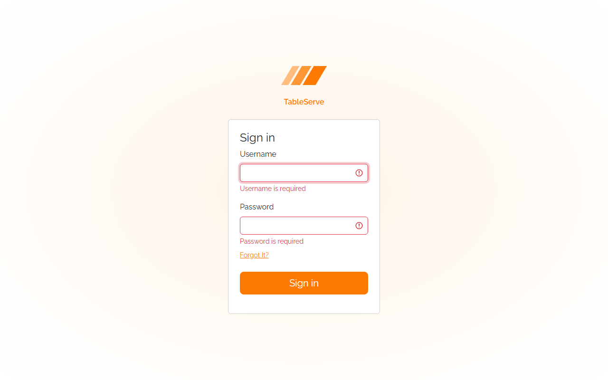
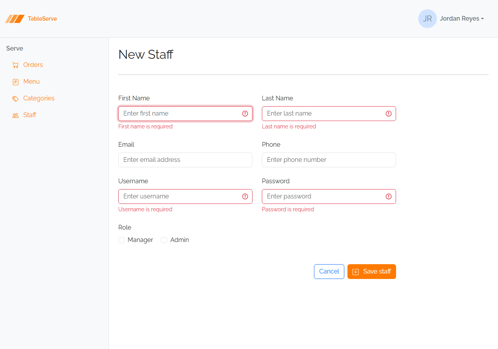
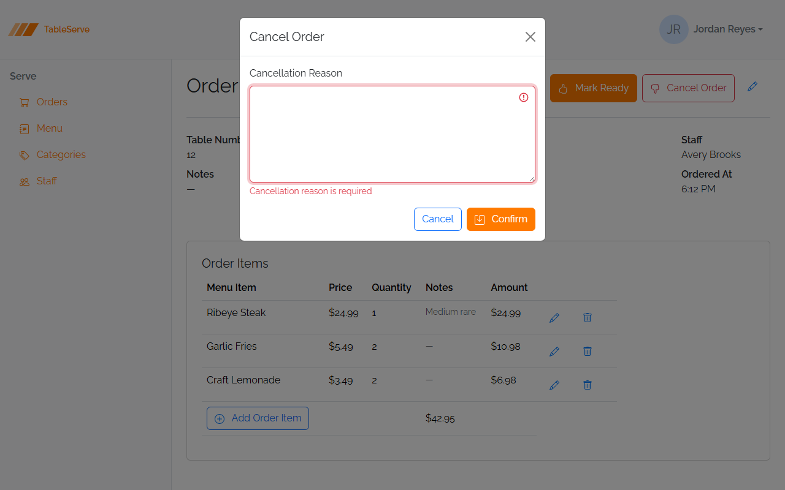

# Lesson 6 Guide — Form Validation States

**Goal:** by the end of this lesson your forms show an **error state on submit** — an
invalid control turns red and a message appears beneath it — driven by one tiny shared
script, `js/validation.js`. You'll wire it into the **Sign In** page, the **Staff**
form, and the **Cancel modal**. This is the exact markup and behavior React's
`react-hook-form` produces in the React pass — you're building the target by hand
first, so converting it later is a straight swap.

**The general pattern you're learning:** every form field has two states — **valid**
(clean) and **invalid** (a message under a red-outlined control). Bootstrap ships both
halves of the invalid state as CSS: add the class **`is-invalid`** to a control and its
sibling **`.invalid-feedback`** message appears. The only real decision is *when* to
add that class — by hand (to understand it), or automatically on **submit** (so a real
form, and a peer reviewer checking your work, can trigger it).

> **How to use this guide.** Sections marked **▶ Code along** are hands-on — build them
> into your project as you read. This is a build-heavy lesson: section 1 is concept,
> and everything after it edits real pages. Read section 1 first, then code along the
> rest and in the lab.

> **A note on JavaScript.** This pass has been markup-only so far — the only script was
> Bootstrap's bundle. Lesson 6 adds **one small script of your own**, `js/validation.js`,
> because a form that never reacts to a bad submit can't be peer-reviewed against the
> error-state screenshots. It's the one sanctioned bit of custom JS in this pass, and
> it's a direct preview of what `react-hook-form` will do for you in React.

---

## 1. The two states of a field

Open `staff-create.html`. Every field is the same three-line wrapper — a label, a
control, and (once you add it) a message slot:

```html
<div class="mb-3 w-50">
  <label for="firstName" class="form-label">First Name</label>
  <input id="firstName" type="text" class="form-control" placeholder="Enter first name" />
</div>
```

Bootstrap's error state is **two additions**:

1. The class **`is-invalid`** on the **control** (`form-control` / `form-select` /
   textarea) — turns it red. **On the control, never the label.**
2. A sibling **`<div class="invalid-feedback">`** right after the control, holding the
   message.

The reason it works with zero JavaScript is one CSS rule Bootstrap already defines:

```css
.is-invalid ~ .invalid-feedback { display: block; }
```

So `.invalid-feedback` is **hidden by default** and reveals the moment its sibling
control has `is-invalid`. Two consequences you'll rely on all lesson:

- The message is just markup — it appears on page load if `is-invalid` is present, no
  submit or script required.
- A hidden feedback div takes **zero height**, so adding one to a clean form changes
  nothing visually. That's why you can add message slots to every field now and the
  page still looks finished.

---

## 2. ▶ Code along — Sign In: add the markup, toggle it by hand

Start with the simplest form, `signin.html`. Give each field a `required` attribute and
a hidden `.invalid-feedback` message:

```html
<div class="mb-3">
  <label for="username" class="form-label">Username</label>
  <input id="username" type="text" class="form-control" required />
  <div class="invalid-feedback">Username is required</div>
</div>
<div class="mb-1">
  <label for="password" class="form-label">Password</label>
  <input id="password" type="password" class="form-control" required />
  <div class="invalid-feedback">Password is required</div>
</div>
```

Save and look — **nothing changed**, because the messages are hidden. Now prove the
mechanism to yourself:

**▶ Save and look.** Add `is-invalid` to the username input by hand —
`class="form-control is-invalid"` — save, and the field turns red with "Username is
required" beneath it. Delete `is-invalid`, save, and it's gone. That single class is
the entire error state.

That hand-toggle is how you *understand* it. It's not how a real form should work —
you can't ask a user (or a peer reviewer) to edit HTML to see the error. Delete any
`is-invalid` you added by hand before moving on; the next section makes submit do it.

---

## 3. Making submit reveal the errors

You want: **click the button with an empty field → the field goes red; fill it in →
the form proceeds.** In React that's `react-hook-form`'s job. In the static pass a
~20-line script does the same thing — it listens for a form's **submit**, adds
`is-invalid` to any control that fails its rule, and lets valid forms through.

The rules it checks are the same three the React app uses:

| Rule | How you declare it | What fires the error |
|---|---|---|
| **required** | `required` on the control | the value is empty |
| **min** (numbers) | `min="1"` on the control | the number is below the minimum |
| **maxlength** | native `maxlength="50"` | *(nothing to check — the browser blocks it; see section 7)* |

`required` and `min` are checked and messaged on submit. `maxlength` is different — the
browser enforces it as you type, so the script never has to.

---

## 4. ▶ Code along — the validation script, wired to Sign In

Create **`js/validation.js`** in the project:

```js
// Reveal validation errors on submit — the static-pass stand-in for react-hook-form.
// Any <form novalidate> is validated; a valid form navigates to its data-success URL.
document.querySelectorAll("form[novalidate]").forEach((form) => {
  form.addEventListener("submit", (event) => {
    event.preventDefault();
    let firstInvalid = null;

    form.querySelectorAll("input, select, textarea").forEach((control) => {
      const value = control.value.trim();
      const min = control.getAttribute("min");
      const invalid =
        (control.required && !value) ||
        (min && value !== "" && Number(value) < Number(min));

      control.classList.toggle("is-invalid", invalid);
      if (invalid) firstInvalid ??= control;
    });

    if (firstInvalid) firstInvalid.focus();
    else if (form.dataset.success) window.location.href = form.dataset.success;
  });
});
```

Read what it does: on submit it stops the browser's own submit, walks every control,
and marks each one `is-invalid` if it fails its rule — empty when `required`, or below
`min`. It **only toggles the class** — the message text lives in the `.invalid-feedback`
div in your markup, exactly like the `required` messages you already wrote. If nothing
failed, it navigates to the form's `data-success` — the static stand-in for "save
succeeded, go to the next page."

Now **wire Sign In** to it. Three edits to `signin.html`:

1. Mark the form so the script picks it up, and tell it where a valid submit goes:
   ```html
   <form class="d-flex flex-column" novalidate data-success="/orders.html">
   ```
2. The current **Sign in** control is an `<a>` — it can't submit a form. Make it a real
   submit button:
   ```html
   <div class="mb-3 d-grid gap-2">
     <button type="submit" class="btn btn-lg btn-primary">Sign in</button>
   </div>
   ```
3. Load the script before `</body>`, after the Bootstrap bundle:
   ```html
   <script src="/node_modules/bootstrap/dist/js/bootstrap.bundle.min.js"></script>
   <script src="/js/validation.js"></script>
   ```

**▶ Save and look.** Click **Sign in** with both fields empty — both turn red with
their messages. Type a username and password, click again — it navigates to
`/orders.html`. That's the whole loop, and it's exactly what `react-hook-form` will do
in React Lesson 7.



> `novalidate` turns *off* the browser's built-in validation bubbles so your Bootstrap
> messages are the only ones shown. The script still reads the `required` attribute — it
> just does the reacting itself, the same way `react-hook-form` does.

---

## 5. ▶ Code along — the Staff form (required + a length limit)

`staff-create.html` is the real target: several required fields, plus two with a
**maximum length**. Add `required` and a message slot to the four required fields
(First Name, Last Name, Username, Password), and a native **`maxlength`** to Username
and Password:

```html
<div class="mb-3 w-50">
  <label for="firstName" class="form-label">First Name</label>
  <input id="firstName" type="text" class="form-control" placeholder="Enter first name" required />
  <div class="invalid-feedback">First name is required</div>
</div>

<!-- ...Last Name the same... -->

<div class="mb-3 w-50">
  <label for="username" class="form-label">Username</label>
  <input id="username" type="text" class="form-control" placeholder="Enter username" required maxlength="50" />
  <div class="invalid-feedback">Username is required</div>
</div>
<div class="mb-3 w-50">
  <label for="password" class="form-label">Password</label>
  <input id="password" type="password" class="form-control" placeholder="Enter password" required maxlength="60" />
  <div class="invalid-feedback">Password is required</div>
</div>
```

Leave **Email** and **Phone** alone — they're optional, so no `required`, no message.
The **Role** checkboxes aren't validated either.

Then wire the form the same way as Sign In — but the **Save staff** button is *already*
`type="submit"`, so you only add the form attributes and the script tag:

```html
<form class="d-flex flex-wrap w-75 gap-2" novalidate data-success="/staff.html">
```
```html
<script src="/js/validation.js"></script>
```

**▶ Save and look.** Click **Save staff** with the form empty — First Name, Last Name,
Username, and Password go red; Email and Phone stay clean. Fill the four required
fields and save — it navigates to `/staff.html`. Try typing past 50 characters in
Username — the field simply stops accepting input (that's `maxlength`; more in
section 7).



---

## 6. ▶ Code along — the Cancel modal

The **Cancel Order** modal in `order-detail.html` already has the markup from Lesson 5 —
a `required` textarea and an `.invalid-feedback` div:

```html
<textarea class="form-control" id="cancellationReason" rows="6" required></textarea>
<div class="invalid-feedback">Cancellation reason is required</div>
```

It just wasn't wired. The validation script finds **any** `form[novalidate]`, including
one inside a modal, so wiring it is the same two attributes on the modal's form:

```html
<form novalidate data-success="/orders.html">
```

**▶ Save and look.** Open **Cancel Order**, leave the reason empty, and click
**Confirm** — the textarea turns red with its message and the modal stays open. Type a
reason and confirm — it navigates to `/orders.html`. This is the pattern PRS's **Reject
modal** uses exactly (a required `rejectionReason` before a status change), so wiring it
here *is* the rehearsal for the capstone.



---

## 7. `maxlength`: an attribute, not a message

`required` and `min` are checked when you submit and show a message. **`maxlength` is
different on purpose** — it's a native HTML attribute that **stops input at the limit as
you type, and truncates a paste** to fit. You literally cannot exceed it in the field,
so there's no error state to show and nothing for the script to check. That's the right
tool when the only goal is "don't let the value get too long."

This is the one place the static pass and React deliberately diverge, and it's worth
knowing why:

- **Here (static):** a native `maxlength` blocks overflow. Simple, and impossible to
  exceed.
- **In React (Lesson 7):** `react-hook-form` uses a `maxLength` **rule** instead, which
  *doesn't* block typing — it validates on submit and shows "Exceeded maximum length."
  That version can be triggered (paste a long value) — and, importantly, **bypassed**
  (client validation is a convenience, not a security boundary). React Lesson 7 uses
  exactly that to show why a real app must also validate on the server.

For now: use `maxlength` on Staff's Username (`50`) and Password (`60`). Just know the
message-based version is coming, and why.

---

## 8. Verifying in the browser

With `npm run dev` running:

1. `/signin.html` — click **Sign in** empty → both fields red with messages. Fill both
   → navigates to `/orders.html`.
2. `/staff-create.html` — **Save staff** empty → the four required fields red, Email and
   Phone clean. Fill the required four → navigates to `/staff.html`.
3. `/order-detail.html` → **Cancel Order** → **Confirm** empty → the textarea goes red,
   modal stays open. Add a reason → navigates to `/orders.html`.
4. On any of them, open DevTools → **Elements**, submit empty, and watch `is-invalid`
   get added to the failing control (and removed when you fix it and resubmit).
5. Check the **Console** for errors — a `404` on `/js/validation.js` means the script tag
   path or the file location is wrong.

---

## 9. How this maps to React

The markup you just wrote is the markup `react-hook-form` renders. In React Lesson 7 the
Staff form's Username field is:

```jsx
<input
  className={`form-control ${errors?.username && "is-invalid"}`}
  {...register("username", { required: "Username is required" })}
/>
<div className="invalid-feedback">{errors?.username?.message}</div>
```

Same `is-invalid` class, same `.invalid-feedback` sibling. React toggles the class *and*
fills the message from `errors`; your static script just toggles the class, with the
message pre-written in the div. Your `data-success` navigation becomes
`navigate("/staff")` after a successful save. Nothing about the error *layout* changes —
you already built it.

---

## The General Pattern (what to take away)

- A field's **error state** is one class on the control (`is-invalid`) plus a sibling
  **`.invalid-feedback`** message — revealed by CSS, no script needed to *show* it.
- Adding hidden message slots to a finished form is **appearance-neutral** — do it to
  every field so the markup is complete.
- **When** the class appears is the only question: by hand to learn it, on **submit** for
  a real form. `js/validation.js` adds it on submit for `required` and `min`.
- **`maxlength`** blocks overflow as an attribute — no message, can't be exceeded. A
  message-based length rule is a React-pass topic.
- This is `react-hook-form`'s error state, hand-built — the React conversion is a swap,
  not a rewrite.

On PRS: every form (Users, Vendors, Products, Requests, RequestLines) gets the same
`required` markup + the script; the **Reject modal** is this Cancel modal; and the
**RequestLine** quantity uses the `min` rule you'll build in the lab. Your finished,
validated PRS static pages are what your peers review against the error-state
screenshots.

---

## Build Steps

1. Create **`js/validation.js`** with the script from section 4.
2. In `signin.html`, add `required` + an `.invalid-feedback` div to Username and
   Password; add `novalidate data-success="/orders.html"` to the form; change the Sign
   in `<a>` to a `<button type="submit">`; load `/js/validation.js`.
3. In `staff-create.html`, add `required` + message divs to First Name, Last Name,
   Username, Password; add `maxlength="50"`/`maxlength="60"` to Username/Password; add
   `novalidate data-success="/staff.html"` to the form; load the script.
4. In `order-detail.html`, add `novalidate data-success="/orders.html"` to the Cancel
   modal's form (its required textarea + message already exist); load the script.
5. Verify all three in the browser per section 8, watching `is-invalid` toggle in
   DevTools.
