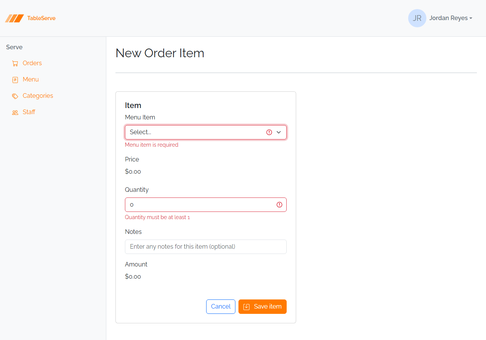

# Lesson 6 Lab — Validating the Order Item Form

Reinforce the validation pattern from the guide on a form with the two pieces the guide
didn't cover: a **required dropdown** and a **numeric minimum**. You'll wire the
**Order Item** create and edit forms to `js/validation.js` so submitting an incomplete
item reveals the error state. Refer back to the guide for the `is-invalid` /
`.invalid-feedback` markup and the script — they're not restated here.

**End goal.** Submitting a blank Order Item form shows "Menu item is required" under the
dropdown and "Quantity must be at least 1" under the Quantity field; choosing an item
and setting a quantity of 1+ navigates to the order detail.



---

## Part A — `orderitem-create.html`

The Menu Item **select** is required, and Quantity has a **minimum of 1**. Price,
Amount, and Notes stay as they are (Price/Amount are display-only; Notes is optional).

1. Make the dropdown required and give it a message slot. A required `<select>` needs an
   **empty-value placeholder** so "nothing chosen" counts as empty — change the
   placeholder option's value from `0` to `""`:
   ```html
   <select id="menuItemId" class="form-select" required>
     <option value="" selected>Select...</option>
     <!-- ...menu item options... -->
   </select>
   <div class="invalid-feedback">Menu item is required</div>
   ```
2. Give Quantity a minimum of 1 and a message slot — hardcode the message in the div,
   exactly like the required fields in the guide:
   ```html
   <input id="quantity" type="number" class="form-control" value="0" min="1" />
   <div class="invalid-feedback">Quantity must be at least 1</div>
   ```
3. Wire the form and load the script (the **Save item** button is already
   `type="submit"`):
   ```html
   <form class="form w-50" novalidate data-success="/order-detail.html">
   ```
   ```html
   <script src="/js/validation.js"></script>
   ```

---

## Part B — `orderitem-edit.html`

4. Apply the same three edits to the edit form: `required` + empty-value placeholder +
   message slot on the dropdown, `min="1"` + a hardcoded message slot on Quantity, and
   `novalidate data-success="/order-detail.html"` + the script tag on the form.
5. Leave the pre-filled `value`s alone — the edit form already has a `selected` menu item
   and a real quantity, so a valid submit sails straight through to the order detail.

---

## Verify in the browser

Browser checks work like the guide's section 8. With `npm run dev` running:

1. `/orderitem-create.html` — click **Save item** without touching anything. The Menu
   Item dropdown goes red with "Menu item is required" and Quantity goes red with
   "Quantity must be at least 1" (its `value` is `0`, below the minimum).
2. Choose a menu item and set Quantity to `1` or more, then **Save item** — it navigates
   to `/order-detail.html`.
3. `/orderitem-edit.html` — **Save item** submits immediately (it's pre-filled and
   valid). Clear the Quantity or set it to `0` and resubmit to see the `min` message
   return.
4. Open DevTools → **Elements** and watch `is-invalid` get added and removed as you
   submit. Check the **Console** for a `404` on `/js/validation.js`.

Same validation pattern, one required select and one numeric minimum — on PRS this is the
**RequestLine** form (required Product dropdown, Quantity `min` of 1), and you'll wire
`js/validation.js` into every PRS form the same way in the capstone. Your validated pages
are what your peers review against the error-state screenshots.

> **Capstone note — your PRS design starter has no `js/validation.js`.** You downloaded
> the PRS design starter before this lesson, so the script isn't in it. Create
> `js/validation.js` yourself (copy it from the
> [Lesson 6 guide](lesson-06-guide-form-validation-states.md)), load it on every form
> page, and wire it into **all** of them — Sign In, User / Vendor / Product / Request
> create & edit, the RequestLine form, and the Reject modal. The exact field-by-field
> rules are in
> [PRS requirements → Static Design Project](../specs/prs-requirements.md#static-design-project).

---

## Stretch challenges

Optional — for when you finish early. Not needed for the capstone.
**[Reinforce]** builds on what you just did; **[Reach]** goes past the guide and needs
some research.

- **Validate the Order form** — [Reinforce] — wire `order-create.html` and
  `order-edit.html`: make **Table Number** required (with a message and
  `data-success="/orders.html"`), so every Order-related form now validates.
- **Sweep the rest of the app** — [Reinforce] — add the `required` markup + `novalidate`
  + the script to the remaining forms (`menuitem-create/edit`, `category-create/edit`,
  `staff-edit`) so no form in the app submits empty. This is the same sweep you'll run
  across the PRS forms.
- **Prove client validation is only a convenience** — [Reach] — in DevTools, disable
  JavaScript (Command Palette → "Disable JavaScript") and submit a blank form: it
  navigates with no validation at all. That's why a real app must *also* validate on the
  server. Not covered in the guide — read
  [Client-side form validation (MDN)](https://developer.mozilla.org/en-US/docs/Learn_web_development/Extensions/Forms/Form_validation).
- **Green "valid" state** — [Reach] — Bootstrap also has `is-valid` + `.valid-feedback`
  for confirming a *correct* field. Add it to one field so a valid entry shows green.
  (Note: the PRS React app doesn't use this — it only flags errors — so keep it as an
  experiment.) Not covered in the guide —
  [Bootstrap validation styles](https://getbootstrap.com/docs/5.3/forms/validation/).
