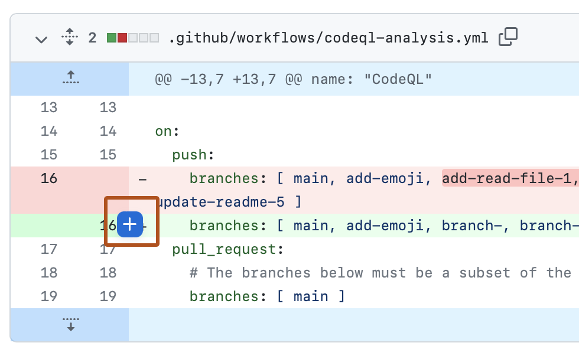
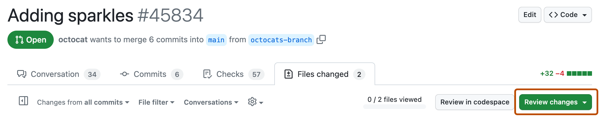

# Git Collaboration Quick Start — Cheat Sheet

An evergreen reference for working in a **shared repository with other developers**. You
already know how to commit and push your own work; this sheet covers what changes when
three people push to the same repo — branches, pull requests, review, merge conflicts, and
worktrees. Keep it open during the team development block.

> **The one rule: `main` is everyone's. Your branch is yours.** Every change reaches `main`
> through a **pull request that a teammate has read**. That single gate is what makes a
> shared codebase survivable — it's why nothing merges unreviewed, and it's why generated
> code can't sneak in unexamined. If you find yourself about to commit straight to `main`,
> you're about to break someone else's afternoon.

---

## How often you do each thing

Collaboration only has three tiers, and knowing which one you're in tells you whether
something is unfamiliar because it's new or because you only ever do it once:

| Tier | Who | What |
|---|---|---|
| **Once per computer** | Everyone | [Configure Git](../team-project/configuring-git.md) — name, email, editor, merge tool, push defaults |
| **Once per project** | The repo **owner** | Create the repository, add collaborators, protect `main` |
| | Everyone else | Accept the invitation, clone the repository |
| **Many times a day** | Everyone | Branch → commit → push → pull request → review → merge → pull `main` |

Almost everything below is the third row. The first two you do once and forget.

---

## Which tool for which job

You work in **two editors** in this course, and their Git UIs are different. The command
line is identical in both, so split the work by task rather than by tool:

| Task | Use | Why |
|---|---|---|
| Staging, committing, writing a message | **The editor's Git panel** — Visual Studio's *Git Changes*, VS Code's *Source Control* | Genuinely better than the CLI here, and you already have the habit |
| Reading a diff before you commit | **The editor's Git panel** | Side-by-side beats terminal output |
| Resolving a merge conflict | **VS Code's merge editor** (or Visual Studio's for `.cs`) | Far better than editing conflict markers by hand |
| Branching, pushing, staying current | **The command line** | Same five commands in both editors, and the integrated terminal is right there |
| Opening and reviewing a pull request | **github.com** | The review UI is the point |

The GUI buttons aren't doing anything mysterious — each one is a command:

| VS Code Source Control | Command line |
|---|---|
| **Initialize Repository** button | `git init` |
| **+** next to a changed file, or next to *Changes* | `git add <file>` / `git add .` |
| Message box, then **Commit** | `git commit -m "message"` |
| **Publish Branch** (first push of a new branch) | `git push -u origin <branch>` |
| **Sync Changes** | `git pull` then `git push` |
| The **⋯** menu → *Pull*, *Push*, *Fetch* | `git pull` / `git push` / `git fetch` |

!!! warning "**Sync Changes** does not bring you your teammates' work"

    Note that those last two are a bare `git pull` — with no `origin main` on the end. A bare
    pull syncs the branch you're on **with its own copy on GitHub**, which on a feature branch
    is just your own commits coming back to you. It will report success and bring you nothing.

    To get `main` into your feature branch you must name it: **`git pull origin main`**. This
    is the single most common way people convince themselves they're up to date when they
    aren't.

---

## The loop

One trip around this per ticket. Steps 1–3 and step 7 are on your machine; **steps 4–6
happen on github.com** and are walked through screen by screen in
[Pull requests](#pull-requests) below.

1. **Start from a fresh `main`, then branch off it.**

    ```bash
    git switch main && git pull origin main
    git switch -c feature/12-filter-requests-by-requester
    ```

2. **Build, committing as you go.** Stage and commit in your editor's Git panel — several
    small commits are fine, they get squashed into one at the end.

3. **Push the branch.**

    ```bash
    git push -u origin feature/12-filter-requests-by-requester
    ```

    The `-u` is only for the **first** push of a branch — it sets that branch's *upstream*,
    the remote branch it tracks, so afterwards Git knows where the branch belongs. Every
    push after that is just `git push`, and you'll do several while answering review
    comments.

    !!! tip "Your Git config already does this for you"

        Because you set `push.autoSetupRemote true` in
        [Configuring Git](../team-project/configuring-git.md), even that first push works as
        a bare `git push` — Git sets the upstream itself instead of failing with *"The
        current branch has no upstream branch."* The `-u` form is written out here so you
        can see what the setting does on your behalf, and because you'll meet machines that
        don't have it configured.

4. **Open the pull request** on github.com — title, description, `Closes #12`.

5. **Get it reviewed.** A teammate reads it, comments, and approves.

6. **Squash-merge it.** GitHub deletes the branch on its side automatically.

7. **Update your local `main`, and tidy up.**

    ```bash
    git switch main && git pull origin main
    git fetch --prune
    git branch -d feature/12-filter-requests-by-requester
    ```

**Step 7 is not optional.** The branch you start next has to begin from a `main` that
includes everything already merged. Skipping it is the single most common cause of ugly
conflicts.

### Command reference

| Command | What it does |
|---|---|
| `git switch main` | Move to the `main` branch (`git checkout main` is the older spelling) |
| `git fetch` | Download everything on GitHub **without changing any of your files** — updates the `origin/*` bookmarks only. The one Git command that can't break anything |
| `git pull origin main` | Fetch GitHub's `main` and merge it into the branch you're standing on |
| `git switch -c feature/12-slug` | Create a new branch **and** move onto it |
| `git switch -` | Jump back to the previous branch |
| `git push -u origin <branch>` | **First** push of a new branch — sets its upstream |
| `git push` | Every push after that, including each answer to a review comment |
| `git status` | What's changed, what's staged, what branch you're on — run it constantly |
| `git branch -vv` | Every local branch and the remote branch it tracks |
| `git fetch --prune` | Drop `origin/*` bookmarks for branches that no longer exist on GitHub |
| `git branch -d <branch>` | Delete a local branch, **refusing** if it has unmerged commits. Never `-D` unless you mean to lose work |
| `git log --oneline -10` | The last ten commits, one line each |

---

## Naming: branches and commits

Both exist so that someone else — a reviewer now, or you in six months — can tell what
happened without opening the diff. That's the whole standard.

### Branch names

```
type/issue-number-short-slug
```

The **issue number** is the important part: it ties the branch, the pull request, and the
ticket to each other, so a reviewer can always find out *why* this work exists.

| Prefix | For |
|---|---|
| `feature/` | New behaviour a user can see |
| `fix/` | A defect |
| `chore/` | Setup, config, dependencies, docs — anything not user-facing |
| `refactor/` | Changing how code is written without changing what it does |

Rules: **lowercase**, **hyphens** between words, no spaces, three to five words. Long enough
to recognise in a branch list, short enough to type.

| Good | Not good | Why |
|---|---|---|
| `feature/12-filter-requests-by-requester` | `feature/RequesterFilter` | Uppercase and no issue number |
| `fix/31-line-delete-total` | `fix/bug` | Which bug? |
| `chore/2-worktree-demo` | `craig-branch-2` | Names the person, not the work |
| `refactor/44-extract-money-helper` | `feature/12-requester-filter-final-v2-REAL` | Rename it, don't version it |

### Commit messages

Write the summary line in the **imperative mood** — as an instruction, not a report. The
test: your message should complete the sentence *"If applied, this commit will ___."*

```
Add requester filter to the requests list
```

*If applied, this commit will* **add requester filter**. That reads correctly. "Added" and
"Adding" don't, and "changes" tells you nothing at all.

| Good | Not good |
|---|---|
| `Add comment count badge to request detail header` | `update` |
| `Recalculate request total when a line is deleted` | `fixed bug` |
| `Extract money() helper from OrderDetailPage` | `changes` |
| `Block vendor delete when products reference it` | `wip` |

The shape, when a commit needs more than one line:

```
Recalculate request total when a line is deleted

Delete was the only write path that didn't call RecalculateRequestTotal,
so removing a line left a stale total on the requests list. Create and
Update already did this.
```

Summary line **under about 50 characters**, capitalised, **no full stop** — it's a title, not
a sentence. Then a blank line, then the body wrapped at around 72 characters.

**The body answers "why," never "what."** The diff already shows what changed; it can't show
what you were thinking. Most commits don't need a body at all — reach for one when the change
would puzzle someone, or when you rejected an obvious-looking alternative.

!!! tip "Because we squash-merge, the pull request title is the message that survives"

    Your branch's individual commits get collapsed into **one** commit on `main` when the
    pull request is squash-merged, and **the pull request title becomes that commit's
    message**.

    Two consequences. Commit as often as you like while you work — `wip` on your own branch
    hurts nobody, because it's about to disappear. But **the pull request title is permanent
    and public**, and it's what `git log` on `main` will show forever, so give that one the
    imperative-mood treatment above.

*(You may run into **Conventional Commits** — `feat:`, `fix:`, `chore:` prefixes on the
message itself. It's a real convention that some teams automate releases from. We don't use
it here; the branch prefix already carries that information.)*

---

## Staying current with `main`

While you build, teammates are merging. Before you open a pull request — and any time
`main` has moved — pull their work into your branch. **Stay on your feature branch** and run:

```bash
git pull origin main
```

That's it. `git pull` is two commands in one — `git fetch` (download what's on GitHub) then
`git merge` (combine it into the branch you're on). So this fetches `main` from GitHub and
merges it into your feature branch without you switching branches at all.

If nothing you touched overlaps, that's the end of it. If it does, you have a conflict.

!!! tip "Why not `git switch main && git pull origin main` first?"

    You can, and you'll want to when you're about to start a *new* branch — that's the one
    time your **local** `main` needs to be current. But to sync a feature branch you're
    mid-way through, `git pull origin main` is one command instead of three and doesn't
    move you off your work.

!!! note "Merge, don't rebase"

    You may see `git rebase main` recommended online. It produces a tidier history and it
    **rewrites commits**, which means force-pushing a branch someone may already have
    looked at. In this course, use `git pull origin main`, which merges. The history is
    slightly messier and nothing can go badly wrong.

---

## Resolving a merge conflict

A conflict means two branches changed the same lines and Git won't guess. It is a normal
event, not a mistake — you'll hit several in this block on purpose.

Git marks the clash inside the file:

```
<<<<<<< HEAD
  the version on your branch
=======
  the version coming from main
>>>>>>> main
```

**Use the merge editor rather than deleting markers by hand.** In VS Code, open the
conflicted file from the Source Control panel and click **Resolve in Merge Editor**; you
get *Incoming*, *Current*, and a *Result* pane, with buttons to accept either side or both.

The judgment call is always the same question: **do I want mine, theirs, or both?** For two
people adding different routes to the same array, the answer is *both* — keep both lines.
For two people editing the same line of logic, stop and go read what the other change was
trying to do before you pick.

When the result is right:

```bash
git add .
git commit
git push
```

**Then re-run the app.** A conflict that resolves cleanly in the editor can still be
nonsense — you may have kept two halves of two different ideas. The compiler catches some
of that; only running it catches the rest.

---

## Pull requests

This is steps 4–6 of the loop, screen by screen.

### Opening one

1. Push your branch (step 3 above), then go to the repository on github.com. A yellow banner
    appears above the file list offering your just-pushed branch. Click
    **Compare & pull request**.

    

    No banner? Open the **Pull requests** tab → **New pull request**, and pick your branch
    in the *compare* dropdown.

2. Check the two branch dropdowns at the top: **base** must be `main` and **compare** must be
    your branch. The arrow reads `main ← your-branch` — you're proposing to merge *into*
    `main`.

3. **Write the title.** Because we squash-merge, this becomes the permanent commit message on
    `main` — give it the imperative treatment from
    [Naming](#naming-branches-and-commits). `Add requester filter to the requests list`, not
    `filters`.

4. **Fill in the description.** The template has three sections, and all three are part of
    the work:

    - **What changed**, in a sentence, and `Closes #12` so the issue closes automatically
      when this merges
    - **How you verified it** — specifically. "Ran it" is not a verification; "picked two
      different requesters and watched the row count change, then ran *Get All Requests* in
      Insomnia with and without the new parameter" is
    - **Where AI was used**, and what you changed or rejected in what it produced

    Filled in, a good one looks like this:

    ```markdown
    ## What this changes

    Adds a **Requested by** filter to the requests list, beside the existing Status
    filter. `RequestsController.GetAll` takes an optional `userId` and applies it the
    same way it already applies `status`; the selection lives in the URL, so it survives
    a refresh and combines with the status filter.

    Closes #12

    ## How I verified it

    - Picked `torrey.schoen` — the table went from eight rows to the one they submitted
    - Picked `hope.hodkiewicz28` — the table changed to her two
    - Set Status to `REVIEW` as well — both filters applied together
    - Refreshed with both set — the dropdowns came back the same
    - Insomnia: `GET /api/requests` still returns all eight; `GET /api/requests?userId=3`
      returns only that user's

    ## AI use

    Copilot Chat to draft the controller change. It suggested filtering in the browser
    off the full `requestAPI.list()` result — rejected, because the status filter two
    lines away goes to the server, and the list of requests only grows. Kept its
    `AsQueryable()` shape after checking it against `GetAll`'s existing status branch.
    ```

    Three things make that one good rather than merely filled in: the verification names
    **specific users and specific counts**, so a reviewer can repeat it; it proves what
    *didn't* change (`GET /api/requests` with no parameter still returns all eight), which is
    where regressions hide; and the AI section names something **rejected**, with the reason. A
    pull request whose AI section reads "used Copilot" tells a reviewer nothing.

5. Click **Create pull request**. It will say **Review required** and the merge button will
    be unavailable — that's branch protection working, not a problem.

### Reviewing one

You are not rubber-stamping. Someone is about to rely on your name being on this.

1. Open your teammate's pull request and click the **Files changed** tab to see the diff.

    

2. **Get their branch and run it.**

    ```bash
    git fetch
    git switch <their-branch>
    ```

    Concretely, reviewing pull request #12 — the branch name is on the pull request page,
    just under the title:

    ```bash
    git fetch
    git switch feature/12-filter-requests-by-requester
    ```

    Git tells you exactly what it did:

    ```
    branch 'feature/12-filter-requests-by-requester' set up to track 'origin/feature/12-filter-requests-by-requester'.
    Switched to a new branch 'feature/12-filter-requests-by-requester'
    ```

    Those two lines are the mechanics described below, confirmed: *"set up to track"* is the
    upstream being wired to the bookmark `git fetch` just updated, and *"a new branch"* is
    the local copy being created from it. You now have their code in your working tree.

    Start the app the way you always do — API running, `npm run dev` in `Prs.Web` — and
    click through the thing the ticket actually describes. For #12 that means picking a couple
    of different requesters from the new dropdown and watching the table change.

    When you're finished, `git switch -` puts you back on the branch you came from.

    If you only read the diff without running it, say so in your review — that's honest, and
    it tells the author what they did and didn't get.

    !!! warning "`git fetch` here, not `git pull`"

        **`fetch` downloads; `pull` downloads *and merges into the branch you're standing
        on*.** You want to go *visit* your teammate's branch, not absorb it into yours.

        `git fetch` updates `origin/<their-branch>` — a read-only bookmark of where that
        branch is on GitHub — and touches nothing else. That's what lets `git switch
        <their-branch>` find a branch you've never had locally: it creates a local branch
        at the same commit and checks it out.

        Type `git pull` instead, *before* switching, and you'd merge their unreviewed work
        into whatever branch you happen to be on — and then you'd be reviewing your own
        merge rather than their change.

        Once you're standing **on** their branch, `git pull` is the right command again —
        see step 6.

        **Rule of thumb: before you're on the branch, fetch; once you're on it, pull.**

        That's about visiting *someone else's* branch. Pulling `main` into your own feature
        branch with `git pull origin main` is a different intent — there you're deliberately
        bringing work in, not going to look at it. Which is the real distinction underneath:
        **fetch to look, pull to bring something into where you're standing.**

3. **Comment on specific lines.** Hover a line in the diff and click the blue **+** that
    appears in the gutter. Line comments are how real review conversations happen; a general
    "looks good" is worth very little to the author. Questions count — *"why a new endpoint
    here?"* is a good review comment.

    

4. When you've read the whole diff, click **Review changes** at the top right of *Files
    changed*, write a one-line summary, and pick one:

    

    The summary is the one thing the author is guaranteed to read, so **say whether you ran
    it** and, if you're blocking, **what would unblock it**. One or two lines is plenty:

    - **Comment** — feedback without a verdict, when you have thoughts but someone else
      should make the call. *"Read through it, didn't run it. Two questions inline — neither
      blocking, so I'll leave the approve to whoever runs it."*
    - **Approve** — you've read it and you're willing to put your name on it landing.
      *"Pulled it down and ran it with both filters set — behaves exactly as described, and
      `GET /api/requests` with no parameter still returns everything, which I checked in
      Insomnia because that's the easy one to break."*
    - **Request changes** — something needs to happen first. Not an insult; it's the
      mechanism working. Say specifically what. *"Ran it — filtering works, but changing the
      requester doesn't refetch until you refresh. One blocker inline."*

    Notice what each of those does in one line: names whether the code was run, then either
    gives a verdict or names the single thing standing in the way. What none of them does is
    describe the diff back to the author — they can see the diff.

5. Click **Submit review**.

6. **If you requested changes, they'll push fixes.** GitHub shows the new commits on the
    pull request. To get them locally, stay on their branch and pull:

    ```bash
    git switch <their-branch>
    git pull
    ```

    A bare `git pull` is correct here — you're **on** their branch now, and switching to it
    set its upstream to `origin/<their-branch>`, so `pull` knows exactly what to fetch and
    what to merge it into. Re-run the app, check the specific thing you flagged, then
    approve.

A useful review of that requester-filter pull request might read like this.

**Two line comments**, left on the diff at the exact lines they're about.

On `RequestTable.tsx`, line 24:

> The dependency array still only watches `status`. The new parameter goes into the
> `requestAPI.list()` call above, but I don't think this effect re-runs when the requester
> changes — picking a name updated the URL and the table stayed put until I refreshed. Worth
> checking whether you tested it by refreshing each time.

On `RequestTable.tsx`, line 40:

> Any reason the signed-in user is pinned above the rest rather than sorted in with everyone?
> Not blocking — just checking it's deliberate rather than an oversight.

**The summary**, submitted as **Request changes**:

> Pulled it down and ran it — filtering works, both filters combine, and the no-parameter case
> is still fine in Insomnia. One thing to fix before I approve: changing the requester doesn't
> refetch until you refresh (see the line comment). The dropdown-order question is curiosity,
> not blocking.

Four things make that a review rather than a rubber stamp. It **says the code was actually
run**, so the author knows what was and wasn't checked. Each finding is **attached to a
line**, not "there's a bug somewhere." It **separates blocking from non-blocking out loud** —
without that, the author has to guess which comments hold up the merge, and usually guesses
wrong. And where the reviewer isn't sure, it **asks instead of asserting**; "any reason this
isn't sorted in?" costs nothing if the answer is good, where "this is wrong" costs an argument.

Notice what that blocker had in common with most real ones: **the diff looked correct.** The
parameter is passed, the dropdown is wired, every line reads fine. The bug is a line that
*wasn't* changed — the dependency array — and no amount of reading the diff would surface it.
This is the concrete version of the warning in the Lesson 1 guide: resolving cleanly and
resolving correctly are different things, and only running the app tells them apart.

The thing not to submit is `LGTM 👍`. It's indistinguishable from not having looked.

### Responding to review

Push more commits to the **same branch** — `git push` is enough now that the upstream is
set. The pull request updates itself: same URL, same conversation, new commits. Reply to
each comment so the reviewer knows what you did, then re-request review.

**You do not open a second pull request.** This trips up almost everyone once.

### Merging

Once you have an approval, click **Squash and merge**, so one ticket becomes one commit on
`main`. Confirm the commit message is your pull request title, not a list of `wip` commits.
GitHub then deletes the branch **on GitHub** automatically.

Back on your machine, three commands — the first is essential, the other two are tidying:

```bash
git switch main && git pull origin main
git fetch --prune
git branch -d feature/12-filter-requests-by-requester
```

- **`git pull origin main`** brings the merged work into your local `main`, so the next
  branch starts from it. This is the one you can't skip.
- **`git fetch --prune`** drops the `origin/feature/12-…` bookmark, which still points at a
  branch that no longer exists on GitHub.
- **`git branch -d <branch>`** deletes your local copy. Auto-delete only cleans up GitHub's
  side; without this your `git branch` list keeps growing while GitHub looks tidy.

!!! tip "`-d` is the safe delete — let it refuse"

    Lowercase `-d` won't delete a branch that has commits which aren't merged anywhere. If
    it refuses, **don't reach for `-D`** — that forces it and throws the work away. Being
    refused means something on that branch never made it into `main`, which is worth thirty
    seconds of checking before you delete it.

*Screenshots in this section are from [GitHub Docs](https://docs.github.com), used under
[CC BY 4.0](https://creativecommons.org/licenses/by/4.0/). GitHub's interface changes from
time to time — trust the labels over the pixels.*

---

## Worktrees — a second working directory

A **worktree** is a second folder on disk, checked out to a different branch, sharing the
same repository. Normally switching branches swaps the files under your feet; with a
worktree you have two branches open at once, in two folders.

That matters most when an **AI agent is working autonomously**. An agent edits files as it
goes — if it's working in the same folder you are, you're both writing to the same files.
Give the agent its own worktree and it can't touch your work.

Run this **from the repository root**:

```bash
git switch main && git pull origin main
git worktree add ../prs-agent-photos -b feature/41-product-photos
cd ../prs-agent-photos
```

You now have a sibling folder on `feature/41-product-photos`, while your original folder
stays exactly where it was.

```bash
git worktree list      # every worktree and the branch it's on
```

!!! warning "Run worktree commands from the repo root"

    `../` in `git worktree add` is relative to **your current directory**, not the
    repository. From the repo root you get a sibling folder. From inside `Prs.Web`, `../` is
    the repo root — so the worktree is created *inside* your repository and shows up as
    untracked clutter forever after.

    `git worktree list` is the exception: it works from anywhere in the repo and prints
    **absolute** paths, so it's the fastest way to confirm the folder landed where you meant.

Two things bite people, both because a worktree is a *fresh folder* containing only the files
Git tracks:

- **Dependencies aren't there.** Run `npm install` in the worktree's own `Prs.Web`.
- **Files excluded by `.gitignore` aren't there** — local config such as
  `appsettings.Development.json`, including your connection string. Copy them across by hand.

When the branch is merged:

```bash
git worktree remove ../prs-agent-photos
```

---

## ⚠️ Watch-list — what actually goes wrong

| Symptom | What happened | Fix |
|---|---|---|
| "My branch is missing a teammate's work" | You branched from a stale `main` | `git pull origin main` from your branch |
| Conflicts on `bin/`, `obj/`, `node_modules/` | Build output got committed | It belongs in `.gitignore`; remove it from tracking |
| "I opened a second pull request to fix the review comments" | Reviews are answered with **commits to the same branch** | Close the second one, push to the original branch |
| Merged, but the next branch still lacks the change | You branched before pulling | `git switch main && git pull origin main` **every time** |
| A conflict "resolved" but the app is broken | Markers deleted without reading both sides | Re-run the app after every conflict resolution |
| Force-push offered as a fix | You rebased a shared branch | Don't rebase here; merge |
| `fatal: Need to specify how to reconcile divergent branches` | You're on a machine where Git was never configured | `git config --global pull.rebase false`, then pull again — see [Configuring Git](../team-project/configuring-git.md) |
| `Updates were rejected because the remote contains work that you do not have` | Someone pushed to that branch after you last pulled | Pull first, then push. **Never force-push to "fix" this** — it deletes their commits from the branch |
| Reviewing a teammate's branch and your own work got mixed in | You pulled their branch instead of switching to it | **Before you're on the branch, fetch; once you're on it, pull** |
| A committed connection string or password | Secrets went into source control | Tell your instructor. Rotating it matters more than deleting it — pushed history is not really erasable |

---

## Learn more

- [About pull requests](https://docs.github.com/en/pull-requests/collaborating-with-pull-requests/proposing-changes-to-your-work-with-pull-requests/about-pull-requests)
  — GitHub's own overview of the review-and-merge flow.
- [Source control in VS Code](https://code.visualstudio.com/docs/sourcecontrol/overview)
  — the Source Control panel and the merge editor.
- [`git worktree`](https://git-scm.com/docs/git-worktree) — the official reference.
