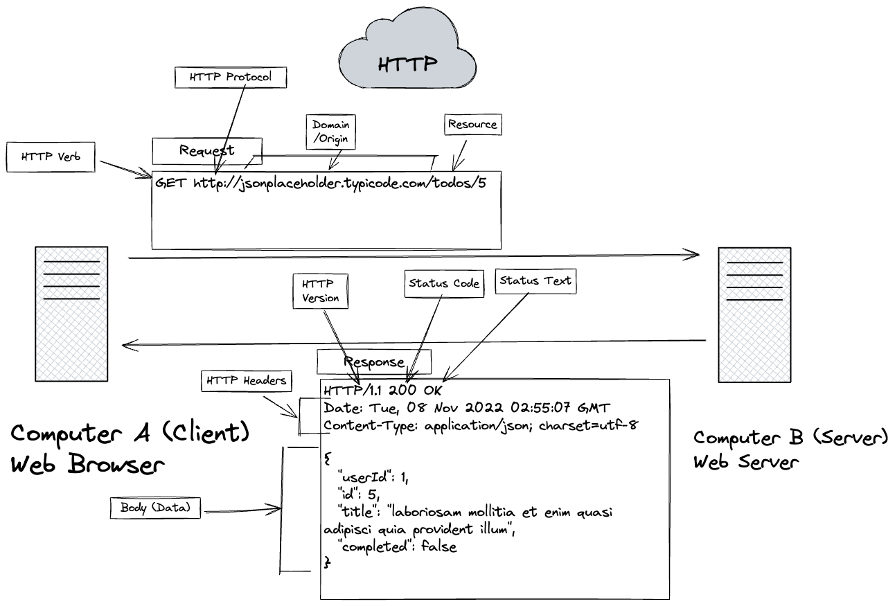
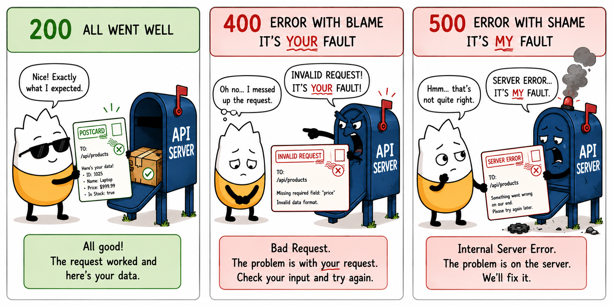
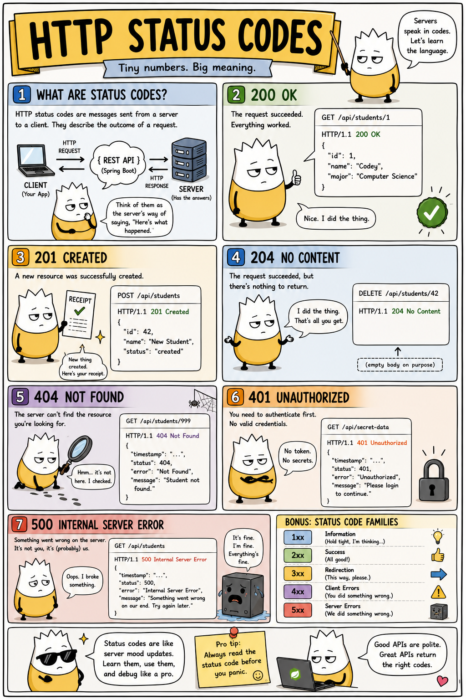
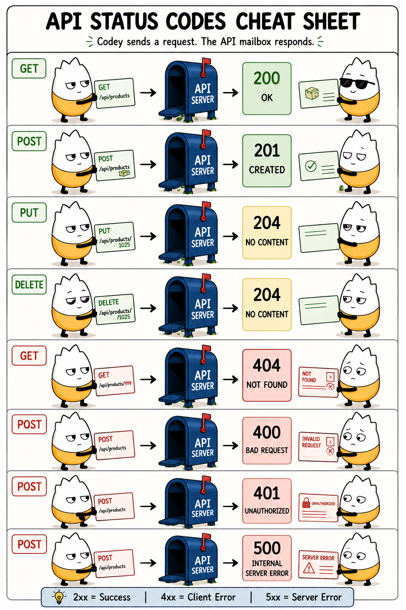

# HTTP, REST, JSON & Status Codes — Cheat Sheet

An evergreen reference for the whole API pass. These concepts are first taught in
**API Lesson 1** ("How Web Apps Talk"); keep this open whenever you're building or
testing an endpoint. Nothing here is stack-specific — it's true of every web API.

---

## HTTP: a request, then a response

Every interaction between a client (a browser, your React app, or Insomnia) and a
server is one **request** and one **response** over HTTP.



**The request** is made of:

| Part | Example | What it is |
|---|---|---|
| **Verb (method)** | `GET` | the action — GET, POST, PUT, DELETE |
| **Protocol** | `http://` / `https://` | how to talk to the server |
| **Domain / origin** | `jsonplaceholder.typicode.com` | which server |
| **Resource (path)** | `/todos/5` | which thing on that server |
| **Headers** | `Content-Type: application/json` | metadata about the request |
| **Body** | `{ "title": "..." }` | the data sent (POST/PUT only) |

**The response** is made of:

| Part | Example | What it is |
|---|---|---|
| **HTTP version** | `HTTP/1.1` | the protocol version |
| **Status code** | `200` | the numeric outcome (see below) |
| **Status text** | `OK` | the human-readable outcome |
| **Headers** | `Content-Type: application/json` | metadata about the response |
| **Body (data)** | `{ "id": 5, ... }` | the data returned, usually JSON |

---

## REST: resources and verbs

A **REST** API models everything as **resources** (nouns) addressed by URL, and uses
HTTP **verbs** to act on them. One resource, four verbs:

| Operation | Verb | URL | Success | Not found | Bad request |
|---|---|---|---|---|---|
| Read all | `GET` | `/api/staff` | 200 OK | — | — |
| Read one | `GET` | `/api/staff/5` | 200 OK | 404 | — |
| Create | `POST` | `/api/staff` | 201 Created | — | — |
| Update | `PUT` | `/api/staff/5` | 200 OK + body | 404 | 400 |
| Delete | `DELETE` | `/api/staff/5` | 204 No Content | 404 | — |

This table is the contract every controller in this course honors.

**Resource-URL rules of thumb:**
- The collection is `/api/{resource}` (plural) — `/api/orders`.
- A single item is `/api/{resource}/{id}` — `/api/orders/5`.
- A custom action on an item uses this course's convention **`/api/{resource}/{id}/{verb}`**
  — id **before** verb — e.g. `PUT /api/orders/5/cancel`.

---

## JSON: the data format

**JSON** (JavaScript Object Notation) is how the body is shaped — a set of
`"key": value` pairs. Values can be strings, numbers, booleans, `null`, arrays, or
nested objects:

```json
{
  "id": 5,
  "tableNumber": 12,
  "status": "PLACED",
  "total": 42.95,
  "orderItems": [
    { "id": 1, "quantity": 2, "menuItem": { "name": "Loaded Nachos" } }
  ]
}
```

Your API sends and receives JSON; the C# side turns C# objects into JSON on the way
out and JSON back into C# objects on the way in (that's **model binding**).

---

## Status codes: the outcome in a number

Every response carries a **status code** — a three-digit number grouping into five
families. Learn the families and you can read any response at a glance:

| Family | Meaning | Whose "fault" |
|---|---|---|
| **1xx** | Informational | — |
| **2xx** | Success | it worked |
| **3xx** | Redirection | look elsewhere |
| **4xx** | Client error | **your request** was wrong |
| **5xx** | Server error | **the server** broke |



The quick mental model: **2xx = all good, 4xx = you messed up the request, 5xx = the
server messed up.**



> **Two notes for this course when reading the infographic above:**
> - It labels the server **"Spring Boot."** Our API is **ASP.NET Core** — the HTTP
>   concepts are identical regardless of the language the server is written in.
> - It shows **`401 Unauthorized`.** This course has **no authentication** — every
>   endpoint is open, login just returns the user object, and there are no tokens —
>   so **you will never see a 401 here.** It's shown for general awareness only.

### The codes you actually use

These six are the entire vocabulary of this course's API:

| Code | Text | When |
|---|---|---|
| **200** | OK | a successful GET / PUT (with a body) |
| **201** | Created | a successful POST (returns the new item + `Location`) |
| **204** | No Content | a successful DELETE (empty body) |
| **400** | Bad Request | the request was malformed (e.g. URL id ≠ body id on PUT) |
| **404** | Not Found | no resource with that id |
| **500** | Internal Server Error | an unhandled exception on the server |



> **Same caveat:** the sheet above includes a `401 Unauthorized` panel. There's no
> auth in this course, so that case doesn't occur here — everything else on the sheet
> is exactly what your API returns.

---

## Learn more

- [HTTP response status codes — MDN](https://developer.mozilla.org/en-US/docs/Web/HTTP/Reference/Status)
  — the authoritative list of every code and when to use it.
- [Web Application Architecture — handsonreact.com](https://handsonreact.com/docs/architecture)
  — where the client, server, and API sit in a single-page app.
- [JSONPlaceholder](https://jsonplaceholder.typicode.com) — a free live fake REST API
  you can hit from Insomnia to practice reading requests and responses.
