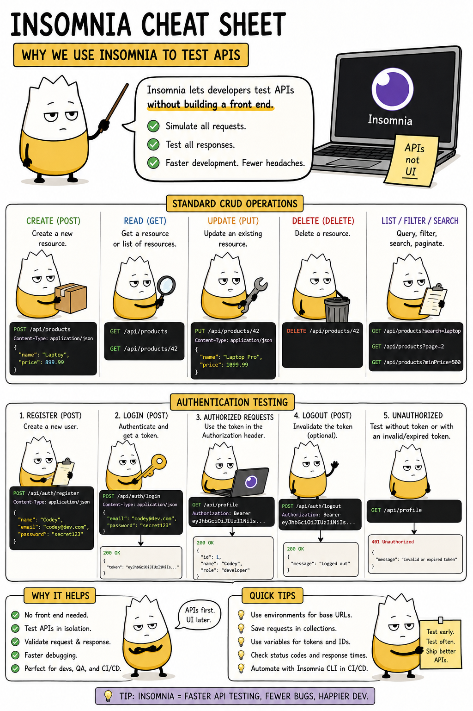

# Insomnia Quick Start — Cheat Sheet

An evergreen reference for testing your API with **Insomnia**. First taught in
**API Lesson 1**; used to verify every endpoint for the rest of the pass. Insomnia
lets you send HTTP requests and inspect responses **without building a front end** —
so you can prove your API works the moment you write it.

> **One caveat for this course:** the sheet above has an **"Authentication Testing"**
> section showing register → get a **token** → send `Authorization: Bearer …`. This
> course has **no JWT and no tokens.** Login just verifies a username/password and
> returns the user object; **every endpoint is open**, so you never attach an
> `Authorization` header and never get a `401`. Use the **CRUD** half of the sheet —
> ignore the token/auth half.

---

## What Insomnia does

It's a desktop app for sending HTTP requests. You pick a **verb** and **URL**, add a
**body** if needed, hit **Send**, and read the **status code** and **response body**.
That's the whole loop — the same request/response a browser or your React app makes,
but on demand and easy to inspect.

The five things you'll do map straight to CRUD:

| In Insomnia | Verb | Example |
|---|---|---|
| **Create** | `POST` | `POST /api/menuitems` with a JSON body |
| **Read** | `GET` | `GET /api/menuitems` or `GET /api/menuitems/5` |
| **Update** | `PUT` | `PUT /api/menuitems/5` with a JSON body |
| **Delete** | `DELETE` | `DELETE /api/menuitems/5` |
| **List / filter** | `GET` | `GET /api/orders?status=PLACED` |

---

## Set-up (once)

1. **Install Insomnia** from [insomnia.rest](https://insomnia.rest) and open it.
2. **Import the collection** — `File → Import`, choose the provided
   [`tableserve-insomnia.json`](https://github.com/craigmckeachie/academy-resources/blob/main/files/tableserve-insomnia.json). The
   **TableServe** collection appears with a folder per entity (Auth, Staff,
   Categories, MenuItems, Orders, OrderItems).
3. **Set `baseUrl`** — run your API in Visual Studio (F5), note the port (e.g.
   `https://localhost:7234`), then in Insomnia set the `baseUrl` environment variable
   to that address. Every request uses `{{ baseUrl }}` so you only set the port once.

> **No login required first.** Because every endpoint is open, you don't have to run
> Login before anything else — the requests work regardless. Login is just there to
> confirm your credentials and show the shape of a user object.

---

## Anatomy of a request in Insomnia

- **Method dropdown** — GET / POST / PUT / DELETE.
- **URL bar** — e.g. `{{ baseUrl }}/api/staff/5`.
- **Body tab** — for POST/PUT, choose **JSON** and type the object. Insomnia sets the
  `Content-Type: application/json` header for you.
- **Send** — fires the request.

## Reading the response

- **Status code** (top of the response panel) — check it first: `200`/`201`/`204` =
  success, `400`/`404` = your request, `500` = the server. (See the
  [HTTP & status codes cheat sheet](http-rest-status-codes.md).)
- **Body** — the JSON returned.
- **Tests tab** — the provided requests have after-response tests. **Green = pass,
  red = fail.** A wall of green means your API matches the contract. If one is red,
  the panel shows expected vs. received — open that controller and compare.

**Connection error?** The API stopped running — press F5 again and confirm the port
matches your `baseUrl`. (There's no auth, so there's no `401` to chase.)

---

## Learn more

- [Insomnia docs](https://docs.insomnia.rest) — the official documentation.
- [HTTP, REST, JSON & Status Codes cheat sheet](http-rest-status-codes.md) — what the
  verbs and status codes mean.
