# Purchase Request System (PRS) Requirements

## Description

The PRS application allows company employees to submit requests to purchase products needed to do their job. Adding products to a request works like adding items to a cart in an online store. Once the employee finishes adding products they submit the request for approval.

Users with **Reviewer** authority can review all submitted requests and decide whether to approve or reject each one.

All primary tables also support full CRUD maintenance.

## Demo

[](https://youtu.be/N9Pj0XCxUhY)

---

## Backend — Prs.Api

### Tech Stack

| Layer | Technology |
|---|---|
| Back end | ASP.NET Core 8 Web API, Entity Framework Core (code-first), SQL Server |
| Password hashing | BCrypt.Net-Next (cost factor 11) — hashes stored at 60 chars |

### Project Structure

```
Prs.Api/
  Controllers/          # One controller per entity — all CRUD + custom endpoints
    UsersController.cs
    VendorsController.cs
    ProductsController.cs
    RequestsController.cs
    RequestLinesController.cs
  Data/
    PrsDbContext.cs     # EF Core DbContext — registers all DbSets
  Models/               # One C# class per entity + status constants
    User.cs
    Vendor.cs
    Product.cs
    Request.cs
    RequestLine.cs
    RequestStatus.cs    # Static class: New, Review, Approved, Rejected string constants
  Migrations/           # Auto-generated by EF Core — do not edit manually
  Program.cs            # App startup: DI, CORS, middleware, route mapping
```

### Getting Started (Backend)

Follow these steps in order to stand up the API and confirm it works. You write
the C# models and controllers — the database schema and the tables are created
for you by EF Core, not by running SQL scripts.

1. **Set the connection string.** In `Prs.Api/appsettings.json`, point the
   connection string at your SQL Server instance and the database named
   **`PrsDbC40`**. The database does not need to exist yet — the next step creates
   it.

2. **Create the schema with migrations.** In Visual Studio's **Package Manager
   Console**, run:

   ```
   Add-Migration InitialCreate
   Update-Database
   ```

   `Add-Migration` generates a C# migration from your models; `Update-Database`
   applies it, creating the `PrsDbC40` database and every table. **You do not run
   the `CREATE TABLE` SQL yourself** — EF Core generates the schema from the C#
   models. (The `CREATE TABLE` statements later in this document are reference
   only; see the note under **Database Schema**.)

3. **Seed the data.** Run [`populate-prs.sql`](https://github.com/craigmckeachie/academy-resources/blob/main/files/populate-prs.sql)
   in SQL Server Management Studio. This script only **inserts rows** (it contains no `CREATE TABLE`) — so
   run it *after* `Update-Database` has created the tables. It seeds **50 vendors,
   50 products, 50 users, and 8 sample requests with line items** so the Requests
   screens and endpoints have data to show on first run. You'll still create your
   own requests through the app's workflow during the capstone. **Every seed
   account's password is the plaintext `test1234`** (stored as a bcrypt hash), so
   you can sign in while testing.

4. **Run the API.** Start `Prs.Api` (F5 in Visual Studio, or `dotnet run`) and
   note the port it listens on.

5. **Verify with Insomnia.** Import the collection [`prs-insomnia.json`](https://github.com/craigmckeachie/academy-resources/blob/main/files/prs-insomnia.json),
   then set the `baseUrl` environment variable to
   your API's address (e.g. `https://localhost:7234`). Run every request in every
   folder and check the **Tests** tab on each. No login is required first — every
   endpoint is open. **Your backend capstone is complete when every request shows
   green in the Tests panel — a wall of green means your backend matches the
   contract.** If anything is red, open that controller and compare it against the
   conventions in this document.

---

### Data Model

The back end uses a code-first approach. Models are C# classes; EF Core generates the schema. `?` in the Notes column means the property is nullable.

#### User

| Property | Type | Notes |
|---|---|---|
| Id | int | PK, auto-increment |
| Username | string | max 30, required, unique |
| Password | string | max 60, required — bcrypt hash, never display |
| FirstName | string | max 30, required |
| LastName | string | max 30, required |
| Phone | string? | max 12, optional |
| Email | string? | max 255, optional |
| IsReviewer | bool | grants access to review/approve workflow |
| IsAdmin | bool | grants access to maintain table data |

#### Vendor

| Property | Type | Notes |
|---|---|---|
| Id | int | PK, auto-increment |
| Code | string | max 30, required, unique |
| Name | string | max 30, required |
| Address | string | max 30, required |
| City | string | max 30, required |
| State | string | max 2, required |
| Zip | string | max 5, required |
| Phone | string? | max 12, optional |
| Email | string? | max 255, optional |

#### Product

| Property | Type | Notes |
|---|---|---|
| Id | int | PK, auto-increment |
| PartNumber | string | max 30, required, unique |
| Name | string | max 30, required |
| Price | decimal | (11,2), required |
| Unit | string | max 30, default `"Each"` |
| PhotoPath | string? | max 255, optional |
| VendorId | int | FK → Vendor |
| Vendor | Vendor? | navigation property — always included in API responses |

#### Request

| Property | Type | Notes |
|---|---|---|
| Id | int | PK, auto-increment |
| Description | string | max 80, required |
| Justification | string | max 80, required |
| RejectionReason | string? | max 80, set by back end on rejection |
| DeliveryMode | string | max 20, `"Pickup"`, `"Delivery"`, or `"Signature Delivery"` |
| Status | string | max 10, default `"NEW"` — managed by back end only |
| Total | decimal | (11,2), default 0 — recalculated by back end after every line item change |
| UserId | int | FK → User |
| User | User? | navigation property |
| RequestLines | ICollection\<RequestLine\> | navigation property |

#### RequestLine

| Property | Type | Notes |
|---|---|---|
| Id | int | PK, auto-increment |
| Quantity | int | default 1 |
| RequestId | int | FK → Request |
| Request | Request? | navigation property — excluded from JSON responses |
| ProductId | int | FK → Product |
| Product | Product? | navigation property |

---

### Database Schema

EF Core generates the schema from the C# models using code-first migrations. The SQL Server database is named **`PrsDbC40`** (configurable in `appsettings.json`).

> **The `CREATE TABLE` SQL below is illustrative reference only — do not run it.**
> It shows the schema EF Core produces from your models so you can see the exact
> column types, keys, and constraints. `Add-Migration` + `Update-Database` (see
> **Getting Started**) create these tables for you.

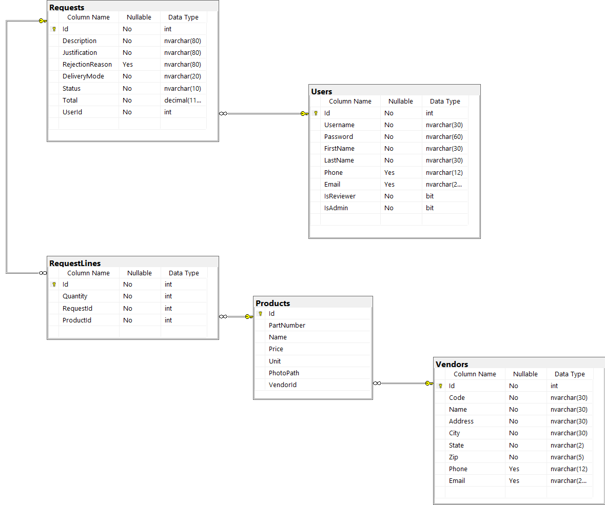

#### Conventions

| Convention | Detail |
|---|---|
| Table names | Plural PascalCase — `Users`, `Vendors`, `Products`, `Requests`, `RequestLines` |
| Column names | PascalCase — `FirstName`, `IsReviewer`, `DeliveryMode`, `RejectionReason` |
| String columns | `NVARCHAR` — supports Unicode |
| Primary keys | `INT IDENTITY(1,1)` — auto-increment integer named `Id` |
| Foreign key columns | `{Entity}Id` — e.g., `UserId`, `VendorId`, `ProductId`, `RequestId` |
| FK constraints | Named `FK_{ChildTable}_{ParentTable}_{Column}`, all with `ON DELETE CASCADE` |
| Unique constraints | Enforced via unique nonclustered indexes (EF Core `[Index(..., IsUnique = true)]`), named `IX_{Table}_{Column}` — not named table constraints |
| Indexes | Auto-generated on every FK column; unique indexes on `Users.Username`, `Vendors.Code`, and `Products.PartNumber` |

#### Tables

```sql
-- Users
CREATE TABLE [dbo].[Users] (
    [Id]         INT           NOT NULL IDENTITY(1,1),
    [Username]   NVARCHAR(30)  NOT NULL,
    [Password]   NVARCHAR(60)  NOT NULL,   -- bcrypt hash
    [FirstName]  NVARCHAR(30)  NOT NULL,
    [LastName]   NVARCHAR(30)  NOT NULL,
    [Phone]      NVARCHAR(12)  NULL,
    [Email]      NVARCHAR(255) NULL,
    [IsReviewer] BIT           NOT NULL,
    [IsAdmin]    BIT           NOT NULL,
    CONSTRAINT [PK_Users] PRIMARY KEY ([Id])
)
CREATE UNIQUE INDEX [IX_Users_Username] ON [dbo].[Users] ([Username])

-- Vendors
CREATE TABLE [dbo].[Vendors] (
    [Id]      INT           NOT NULL IDENTITY(1,1),
    [Code]    NVARCHAR(30)  NOT NULL,
    [Name]    NVARCHAR(30)  NOT NULL,
    [Address] NVARCHAR(30)  NOT NULL,
    [City]    NVARCHAR(30)  NOT NULL,
    [State]   NVARCHAR(2)   NOT NULL,
    [Zip]     NVARCHAR(5)   NOT NULL,
    [Phone]   NVARCHAR(12)  NULL,
    [Email]   NVARCHAR(255) NULL,
    CONSTRAINT [PK_Vendors] PRIMARY KEY ([Id])
)
CREATE UNIQUE INDEX [IX_Vendors_Code] ON [dbo].[Vendors] ([Code])

-- Products (depends on Vendors)
CREATE TABLE [dbo].[Products] (
    [Id]         INT           NOT NULL IDENTITY(1,1),
    [PartNumber] NVARCHAR(30)  NOT NULL,
    [Name]       NVARCHAR(30)  NOT NULL,
    [Price]      DECIMAL(11,2) NOT NULL,
    [Unit]       NVARCHAR(30)  NOT NULL,
    [PhotoPath]  NVARCHAR(255) NULL,
    [VendorId]   INT           NOT NULL,
    CONSTRAINT [PK_Products] PRIMARY KEY ([Id]),
    CONSTRAINT [FK_Products_Vendors_VendorId]
        FOREIGN KEY ([VendorId]) REFERENCES [dbo].[Vendors] ([Id]) ON DELETE CASCADE
)
CREATE UNIQUE INDEX [IX_Products_PartNumber] ON [dbo].[Products] ([PartNumber])

-- Requests (depends on Users)
CREATE TABLE [dbo].[Requests] (
    [Id]              INT           NOT NULL IDENTITY(1,1),
    [Description]     NVARCHAR(80)  NOT NULL,
    [Justification]   NVARCHAR(80)  NOT NULL,
    [RejectionReason] NVARCHAR(80)  NULL,
    [DeliveryMode]    NVARCHAR(20)  NOT NULL,
    [Status]          NVARCHAR(10)  NOT NULL,
    [Total]           DECIMAL(11,2) NOT NULL,
    [UserId]          INT           NOT NULL,
    CONSTRAINT [PK_Requests] PRIMARY KEY ([Id]),
    CONSTRAINT [FK_Requests_Users_UserId]
        FOREIGN KEY ([UserId]) REFERENCES [dbo].[Users] ([Id]) ON DELETE CASCADE
)

-- RequestLines (depends on Requests and Products)
CREATE TABLE [dbo].[RequestLines] (
    [Id]        INT NOT NULL IDENTITY(1,1),
    [Quantity]  INT NOT NULL,
    [RequestId] INT NOT NULL,
    [ProductId] INT NOT NULL,
    CONSTRAINT [PK_RequestLines] PRIMARY KEY ([Id]),
    CONSTRAINT [FK_RequestLines_Requests_RequestId]
        FOREIGN KEY ([RequestId]) REFERENCES [dbo].[Requests] ([Id]) ON DELETE CASCADE,
    CONSTRAINT [FK_RequestLines_Products_ProductId]
        FOREIGN KEY ([ProductId]) REFERENCES [dbo].[Products] ([Id]) ON DELETE CASCADE
)
```

---

### Business Rules

#### Auto-Approval
Any request with a total of **$50.00 or less** is automatically approved when submitted for review — the back end sets status directly to `"APPROVED"`. These requests never appear in the review queue.

#### Request Status Flow
```
NEW → REVIEW → APPROVED
             ↘ REJECTED
```
Status is always set by the back end. The front end triggers transitions only via the workflow endpoints (`/review`, `/approve`, `/reject`).

#### Roles
- Every person in the User table is a basic user.
- A user can also be a **Reviewer** and/or an **Admin** (the two flags are independent).
- Only **Reviewers** can approve or reject requests.
- A **Reviewer may not approve or reject their own requests** — the Approve and Reject buttons are disabled on the Detail page when the request belongs to the logged-in user.
- Only **Admins** can access the CRUD maintenance pages.

#### Password Security
Passwords are stored as bcrypt hashes (60 characters). The API returns the hashed password in user responses — the front end must strip it immediately after login and never display or store it.

---

### HTTP Response Conventions

| Verb | Success | Not Found | Bad Request |
|---|---|---|---|
| GET | 200 OK | 404 | — |
| POST | 201 Created + body | — | — |
| PUT | 200 OK + body | 404 | 400 |
| DELETE | 204 No Content | 404 | — |

---

### API Quick Reference

| Action | Method | Endpoint | Notes |
|---|---|---|---|
| Login | POST | `/api/users/login` | Body: `{ username, password }` |
| Get all users | GET | `/api/users` | |
| Get user by ID | GET | `/api/users/{id}` | |
| Create user | POST | `/api/users` | Returns created user with ID |
| Update user | PUT | `/api/users/{id}` | Returns updated user (200 with body) |
| Delete user | DELETE | `/api/users/{id}` | |
| Get all vendors | GET | `/api/vendors` | |
| Create vendor | POST | `/api/vendors` | |
| Update vendor | PUT | `/api/vendors/{id}` | Returns updated vendor (200 with body) |
| Delete vendor | DELETE | `/api/vendors/{id}` | |
| Get all products | GET | `/api/products` | |
| Create product | POST | `/api/products` | Returns product with nested vendor |
| Update product | PUT | `/api/products/{id}` | Returns updated product (200 with body) |
| Delete product | DELETE | `/api/products/{id}` | |
| Get all requests | GET | `/api/requests` | |
| Get requests by status | GET | `/api/requests?status=REVIEW` | Used for status filter and review queue |
| Create request | POST | `/api/requests` | Returns request with nested user |
| Update request | PUT | `/api/requests/{id}` | Returns updated request (200 with body) |
| Delete request | DELETE | `/api/requests/{id}` | |
| Send for review | PUT | `/api/requests/{id}/review` | Sets status to REVIEW (or APPROVED if total ≤ $50) |
| Approve request | PUT | `/api/requests/{id}/approve` | Sets status to APPROVED |
| Reject request | PUT | `/api/requests/{id}/reject` | Body: plain rejection reason string; sets status to REJECTED |
| Get all line items | GET | `/api/requestlines` | Returns every line item — `GetAll` has no filter parameter, so a `?requestId=` query string is ignored server-side. The front end never calls this endpoint; line items are always obtained from the nested `requestLines` array on `GET /api/requests/{id}` |
| Create line item | POST | `/api/requestlines` | Recalculates request total; returns item with navigation properties |
| Update line item | PUT | `/api/requestlines/{id}` | Recalculates request total; returns updated item (200 with body) |
| Delete line item | DELETE | `/api/requestlines/{id}` | Recalculates request total |

---

## Frontend — Prs.Web

### Tech Stack

| Layer | Technology |
|---|---|
| Front end | React 18, TypeScript, Vite, react-hook-form, react-router-dom, Bootstrap |
| API base URL | `http://localhost:5555/api` |

### Project Structure

The app shell and router live at the root of `src/`. All feature code lives in a **feature folder** named after the entity (plural for pages, singular for interfaces).

```
src/
  # App shell
  main.tsx              # Router definition — all routes declared here
  App.tsx               # Root component — UserContext provider, Toaster
  Layout.tsx            # Shared layout: Header + AppNav + <Outlet>
  AppNav.tsx            # Left sidebar nav links
  Header.tsx            # Top bar: logo, signed-in user dropdown, sign-in button
  IndexPage.tsx         # Redirect-only: → /signin or /requests
  ErrorPage.tsx         # React Router error boundary
  App.css

  # Feature folders — one per entity
  account/
    SignInPage.tsx

  requests/
    IRequest.ts         # TypeScript interface
    RequestAPI.ts       # Fetch wrappers: list, find, post, put, delete, review, approve, reject
    RequestsPage.tsx    # List page (route target)
    RequestTable.tsx    # Table + status filter dropdown
    RequestRow.tsx      # Single table row with three-dots dropdown
    RequestCreatePage.tsx
    RequestEditPage.tsx
    RequestForm.tsx     # Shared form used by create and edit pages
    RequestDetailPage.tsx  # Detail view + items table + workflow buttons
    RequestHeader.tsx   # Read-only summary display (description, status, etc.)

  requestLines/
    IRequestLine.ts
    RequestLineAPI.ts
    RequestLineCreatePage.tsx
    RequestLineEditPage.tsx
    RequestLineForm.tsx    # Shared form: product dropdown, price/amount display, quantity
    RequestLineTable.tsx   # Items card with table, Add a line button, running total

  products/
    IProduct.ts
    ProductAPI.ts
    ProductsPage.tsx
    ProductList.tsx
    ProductCard.tsx
    ProductCardSkeleton.tsx   # Loading placeholder shown while fetching
    ProductCreatePage.tsx
    ProductEditPage.tsx
    ProductForm.tsx

  vendors/
    IVendor.ts
    VendorAPI.ts
    VendorsPage.tsx
    VendorList.tsx
    VendorCard.tsx
    VendorCardSkeleton.tsx
    VendorCreatePage.tsx
    VendorEditPage.tsx
    VendorForm.tsx

  users/
    IUser.ts
    UserAPI.ts
    UsersPage.tsx
    UserList.tsx
    UserCard.tsx
    UserCreatePage.tsx
    UserEditPage.tsx
    UserForm.tsx

  utility/
    fetchUtilities.ts   # BASE_URL constant, checkStatus and parseJSON fetch helpers
    formatUtilities.ts  # formatPhoneNumber, getTextBackgroundByStatus (badge colors)

  assets/
    bootstrap-icons.svg
```

#### Feature Folder Pattern

Each entity's folder follows this consistent pattern:

| File | Role |
|---|---|
| `I{Entity}.ts` | TypeScript interface — the shape of the entity object |
| `{Entity}API.ts` | All fetch calls for that entity (list, find, post, put, delete) |
| `{Entity}sPage.tsx` | Route target — page heading, create button, renders the list component |
| `{Entity}List.tsx` / `{Entity}Table.tsx` | Renders the full collection |
| `{Entity}Card.tsx` / `{Entity}Row.tsx` | Renders one item (card grid or table row) with the three-dots action dropdown |
| `{Entity}Form.tsx` | Shared form component — handles both create (no id) and edit (id in params) |
| `{Entity}CreatePage.tsx` | Thin wrapper — renders `{Entity}Form` without an id |
| `{Entity}EditPage.tsx` | Thin wrapper — reads `:id` from params and renders `{Entity}Form` |

`RequestDetailPage` breaks from the standard pattern because it serves as detail view, line item manager, and workflow action screen in one page.

---

### App Shell

Every page except Sign In is wrapped in a shared layout: a fixed **header bar** at the top and a **left sidebar** beneath it.

**Header bar** — app logo + "Purchase Request System" title (links to `/`). When signed in: user's first + last name with a dropdown containing **Settings**, **Profile**, and **Sign out**. When signed out: a **Sign in** button linking to `/signin`.

**Left sidebar** — "Purchase" section label followed by nav links:

| Link | Route |
|---|---|
| Requests | `/requests` |
| Products | `/products` |
| Vendors | `/vendors` |
| Users | `/users` |

---

### Routes Summary

| Route | Page | Notes |
|---|---|---|
| `/signin` | Sign In | Outside the app shell layout |
| `/` | Home | Redirects to `/signin` if no user is in context, or to `/requests` if signed in. Renders nothing while the redirect fires. |
| `/requests` | Requests List | Supports `?status=` filter |
| `/requests/create` | Request Create | |
| `/requests/edit/:id` | Request Edit | |
| `/requests/detail/:id` | Request Detail | Also hosts workflow actions and line items |
| `/requests/detail/:id/requestline/create` | Line Item Create | |
| `/requests/detail/:id/requestline/edit/:lineId` | Line Item Edit | |
| `/products` | Products List | |
| `/products/create` | Product Create | |
| `/products/edit/:id` | Product Edit | |
| `/vendors` | Vendors List | |
| `/vendors/create` | Vendor Create | |
| `/vendors/edit/:id` | Vendor Edit | |
| `/users` | Users List | |
| `/users/create` | User Create | |
| `/users/edit/:id` | User Edit | |

---

### Sign In Page (`/signin`)

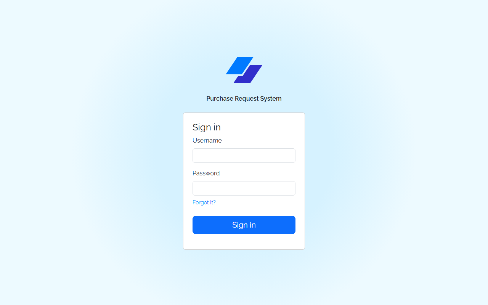

Centered layout with app logo, title, and a card containing:

| Field | Type | Validation |
|---|---|---|
| Username | text | Required |
| Password | password | Required |

A "Forgot It?" link is shown below the password field (placeholder, no functionality required). A full-width **Sign in** button submits the form.

**Endpoint:** `POST /api/users/login`  
**Request body:** `{ "username": "...", "password": "..." }`

On success: strip the `password` field from the response, persist the rest of the user object to `localStorage`, set user context, and navigate to `/requests`.

On failure: display a toast — "Unsuccessful sign in. Please try again."

---

### Requests List (`/requests`)

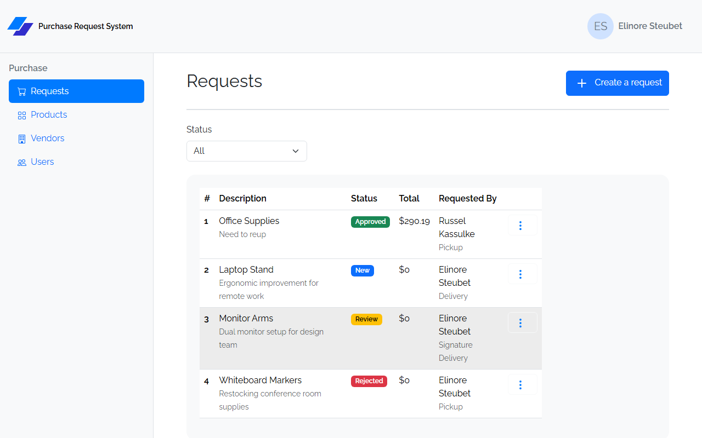

**Header:** "Requests" heading + **Create a request** button → `/requests/create`

**Status filter** — a dropdown above the table with options `All`, `New`, `Review`, `Approved`, `Rejected`. Selecting a value appends `?status={VALUE}` to the URL and re-fetches `GET /api/requests?status={VALUE}`.

**Table columns:**

| Column | Notes |
|---|---|
| # | `request.id` |
| Description | Primary text; justification displayed below in secondary style |
| Status | Colored badge |
| Total | Formatted as `$N` |
| Requested By | First + last name; delivery mode displayed below in secondary style |
| *(actions)* | Three-dots dropdown: **Review** → `/requests/detail/:id`, **Edit** → `/requests/edit/:id`, **Delete** (with confirm dialog) |

Delete removes the row from the list on success and shows a success toast.

---

### Request Create (`/requests/create`) / Request Edit (`/requests/edit/:id`)

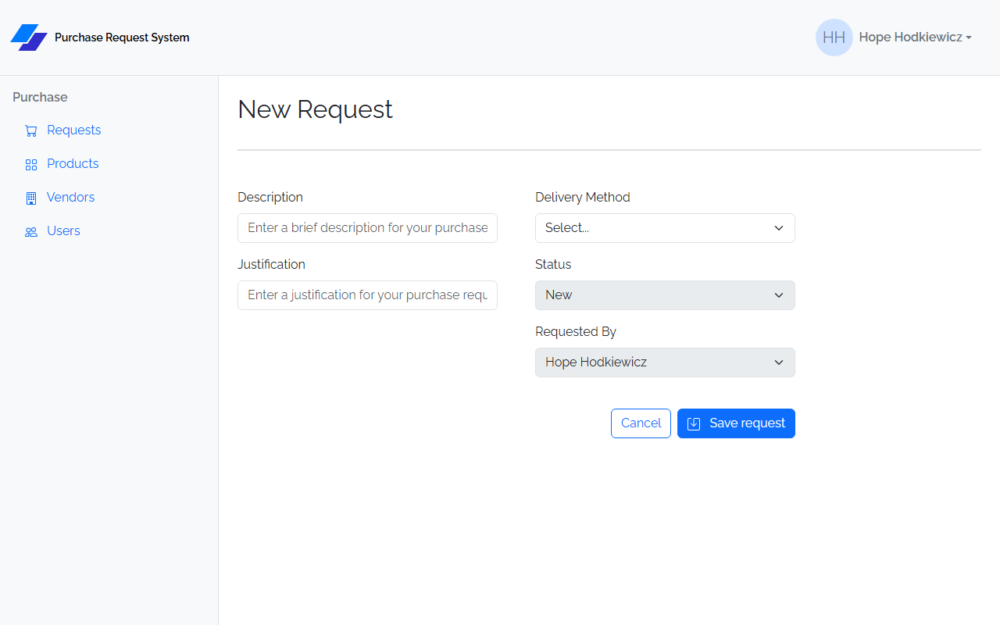
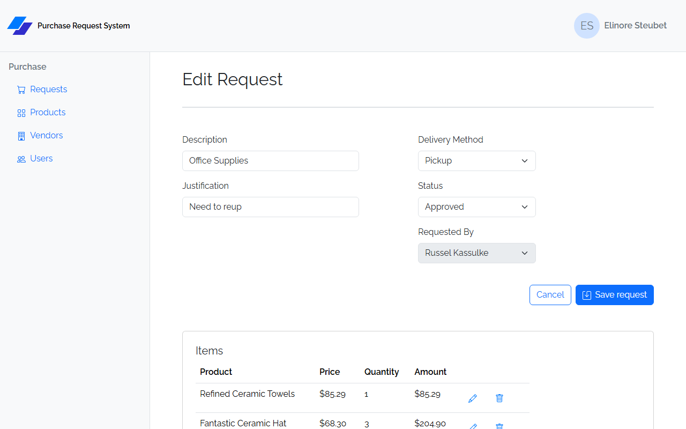

Both pages render the same form. On save, both navigate to `/requests/detail/{id}`.

**Form fields:**

| Field | Input | Validation |
|---|---|---|
| Description | text | Required |
| Justification | text | Required |
| Delivery Method | select | Required; options: Pickup, Delivery, Signature Delivery |
| Status | select | Required; options: New, Review, Approved, Rejected; **disabled on Create**, editable on Edit |
| Requested By | select | Always disabled; pre-populated from the logged-in user's ID |

On Create: POSTs to `POST /api/requests`, then redirects to the new request's detail page.  
On Edit: PUTs to `PUT /api/requests/:id`, then redirects to the request's detail page.

<!-- On Edit only (the request already has an `id`), the same **Items table** shown on Request Detail also renders below the form, so line items can be added, edited, or deleted directly from the Edit page without navigating away. It does not appear on Create, since a new request has no `id` yet and therefore no line items. -->

---

### Request Detail (`/requests/detail/:id`)

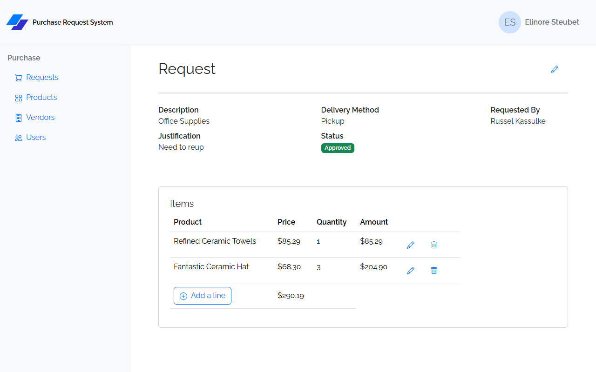

The central screen for a request. Combines the detail view, line item management, and all workflow actions on one page.

**Page header row** — "Request" heading on the left; workflow buttons on the right (see below); Edit (pencil icon) link to `/requests/edit/:id` always present.

**Request summary** — three definition-list columns:

| Column 1 | Column 2 | Column 3 |
|---|---|---|
| Description | Delivery Method | Requested By (first + last name) |
| Justification | Status (colored badge) | Rejection Reason *(only shown if present)* |

**Workflow buttons** — conditional on `request.status`:

| Status | Buttons shown |
|---|---|
| `NEW` | **Send for Review** |
| `REVIEW` | **Approve** + **Reject** (both disabled if request belongs to logged-in user; warning alert is shown) |
| `APPROVED` / `REJECTED` | *(no workflow buttons)* |

**Items table** (card titled "Items"):

| Column | Notes |
|---|---|
| Product | Product name |
| Price | Formatted as currency |
| Quantity | |
| Amount | Price × Quantity, formatted as currency |
| *(actions)* | Edit (pencil) → `/requests/detail/:id/requestline/edit/:lineId`; Delete (trash, with confirm dialog) |

Table footer: **Add a line** button → `/requests/detail/:id/requestline/create`; running total formatted as currency (calculated client-side from line items).

#### Send for Review

`PUT /api/requests/{id}/review` — sets status to `REVIEW` (or auto-approves to `APPROVED` if total ≤ $50). Navigates to `/requests` on success.

#### Approve

`PUT /api/requests/{id}/approve` — sets status to `APPROVED`. Navigates to `/requests` on success.

#### Reject

Opens a **Bootstrap modal** with:
- **Rejection Reason** — textarea; required; inline error shown if submitted empty
- **Cancel** button (closes modal without saving)
- **Save** button — calls `PUT /api/requests/{id}/reject` with the reason as a plain string body (not JSON-wrapped). Sets status to `REJECTED`. Closes modal and navigates to `/requests` on success.

---

### Line Item Create / Edit

**Create:** `/requests/detail/:id/requestline/create`  
**Edit:** `/requests/detail/:id/requestline/edit/:lineId`

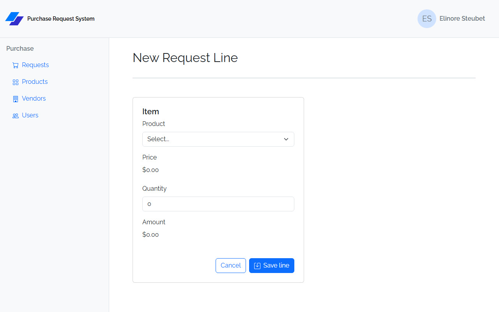
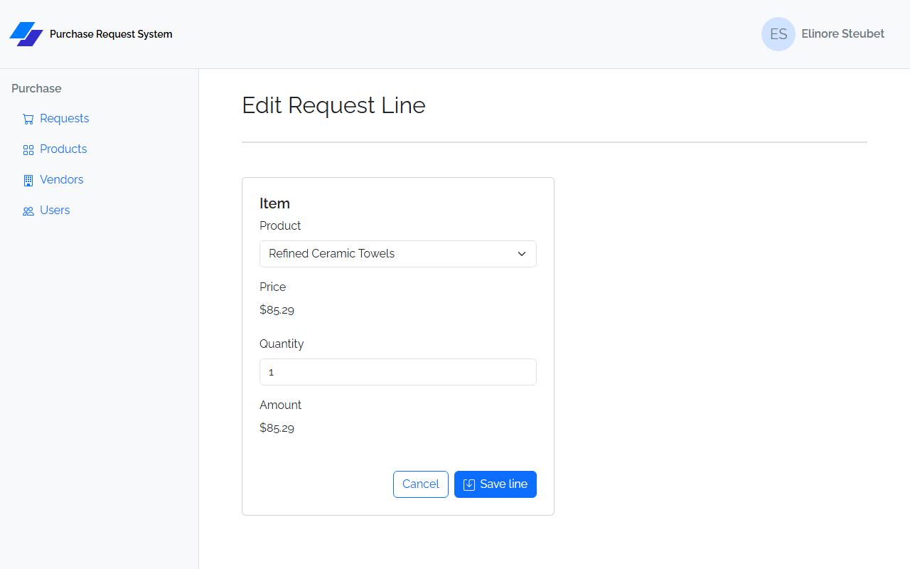

Both use the same form page (card titled "Item"):

| Field | Input | Validation |
|---|---|---|
| Product | select | Required; loaded from `GET /api/products`; displays product name |
| Price | read-only display | Auto-populated from selected product; formatted as currency; no user input |
| Quantity | number | Required; minimum 1 |
| Amount | read-only display | Price × Quantity, recalculated client-side on product/quantity change; formatted as currency; no user input |

**Cancel** navigates back to `/requests/detail/:id`.

On save: POSTs or PUTs the line item. The back end recalculates and updates `request.total`. The POST/PUT response includes nested `product` (with `vendor`) navigation properties. Redirects to `/requests/detail/{requestId}` on success.

---

### Products List (`/products`)

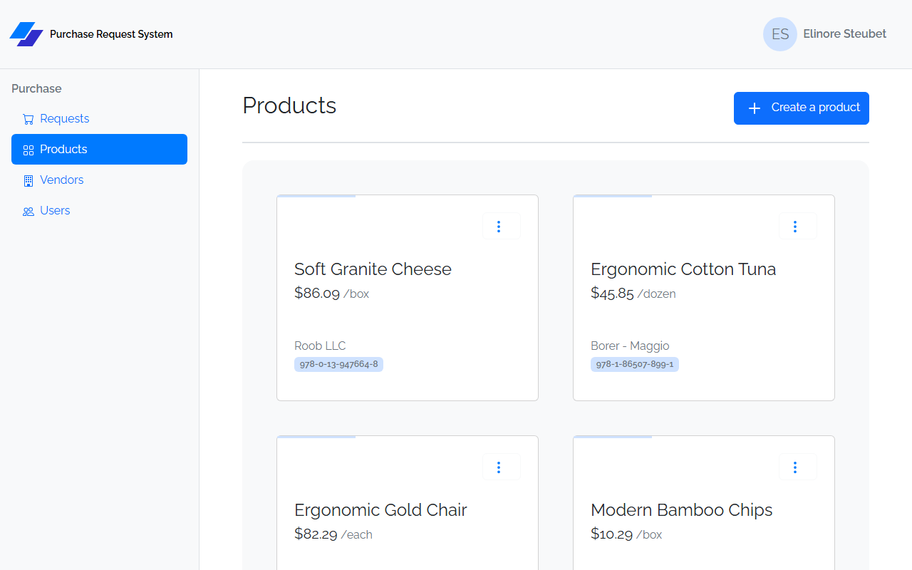

**Header:** "Products" heading + **Create a product** button → `/products/create`

Displays products as a **card grid** (not a table). Each card shows:
- Product name (large)
- Price / unit (e.g., `$12.99 /each`)
- Vendor name (bottom of card)
- Part number (badge)
- Three-dots dropdown: **Edit** → `/products/edit/:id`, **Delete** (with confirm dialog)

---

### Product Create (`/products/create`) / Product Edit (`/products/edit/:id`)

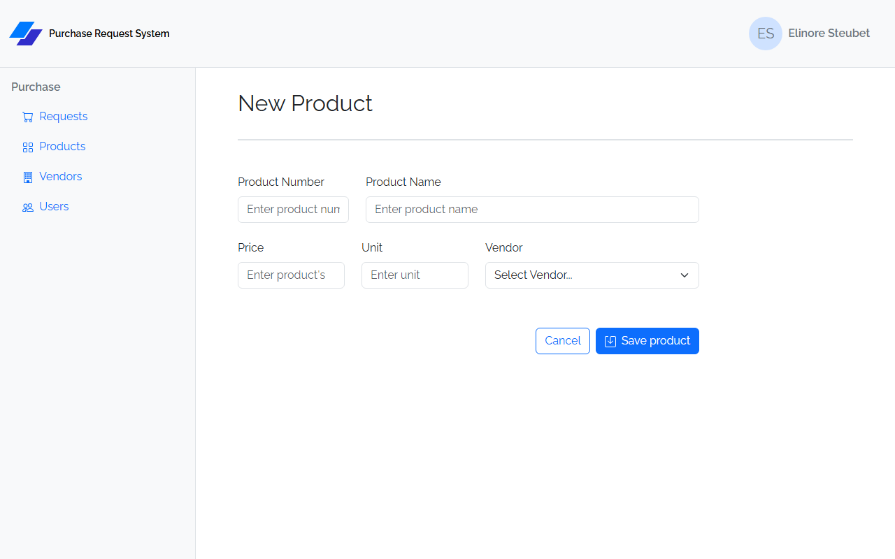


| Field | Input | Validation |
|---|---|---|
| Product Number | text | Required; max 20 characters |
| Product Name | text | Required |
| Price | number | Required; `step="0.01"` (allows decimals) |
| Unit | text | Required |
| Vendor | select | Required; loaded from `GET /api/vendors` |

On save: navigates to `/products`. POST returns the product with nested vendor; no refetch needed.

---

### Vendors List (`/vendors`)

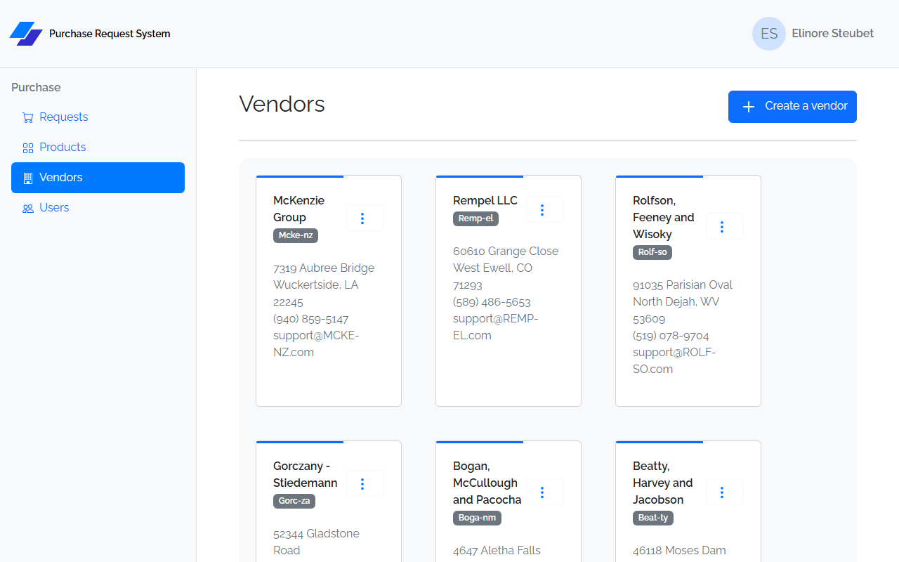

**Header:** "Vendors" heading + **Create a vendor** button → `/vendors/create`

Displays vendors as a **card grid**. Each card shows:
- Vendor name + code badge
- Address, City / State / Zip
- Phone (formatted)
- Email
- Three-dots dropdown: **Edit** → `/vendors/edit/:id`, **Delete** (with confirm dialog)

---

### Vendor Create (`/vendors/create`) / Vendor Edit (`/vendors/edit/:id`)

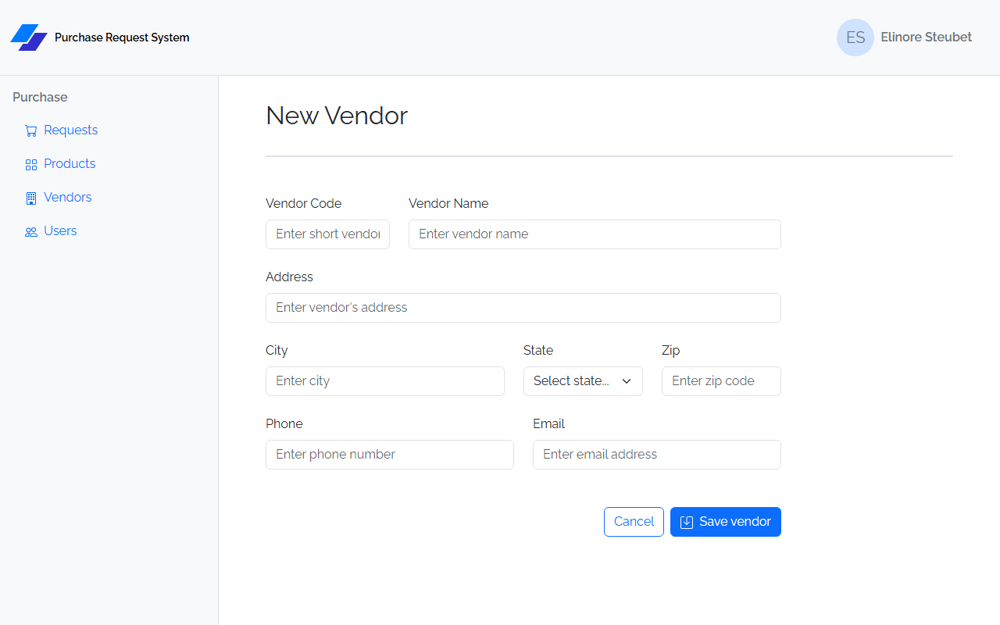
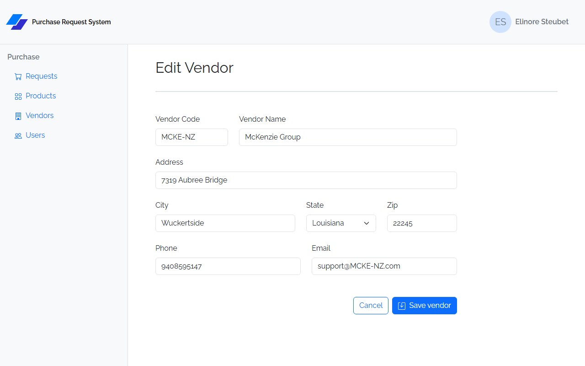

| Field | Input | Validation |
|---|---|---|
| Vendor Code | text | Required; max 7 characters |
| Vendor Name | text | Required |
| Address | text | Required |
| City | text | Required |
| State | select | Required; full list of US states; stores 2-letter abbreviation |
| Zip | text | Required |
| Phone | text | Optional |
| Email | email | Optional |

On save: navigates to `/vendors`.

---

### Users List (`/users`)

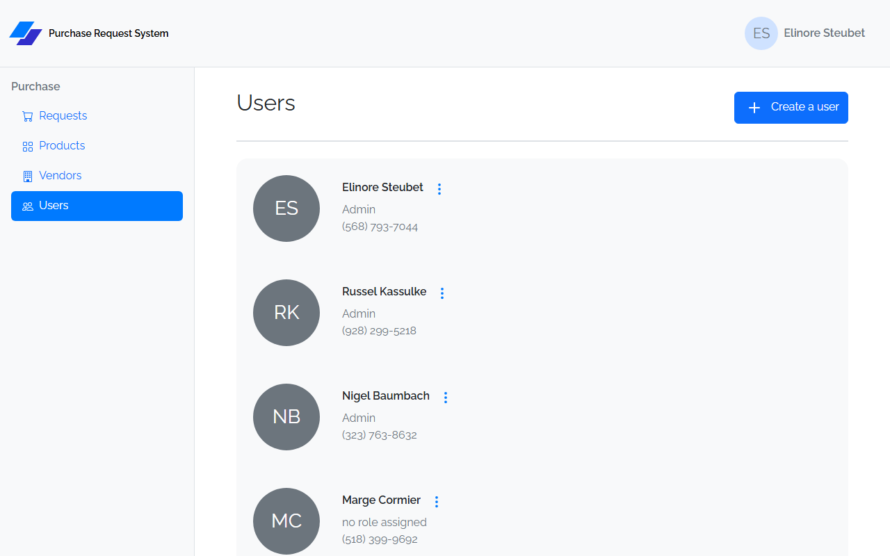

**Header:** "Users" heading + **Create a user** button → `/users/create`

Displays users as a **card grid**. Each card shows:
- Avatar circle with initials (first + last initial)
- Full name
- Role: `Admin`, `Reviewer`, or `no role assigned` (Admin takes priority when both flags are true)
- Phone (formatted)
- Three-dots dropdown: **Edit** → `/users/edit/:id`, **Delete** (with confirm dialog)

---

### User Create (`/users/create`) / User Edit (`/users/edit/:id`)

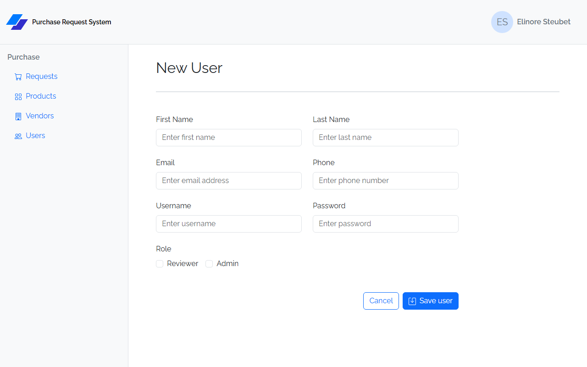
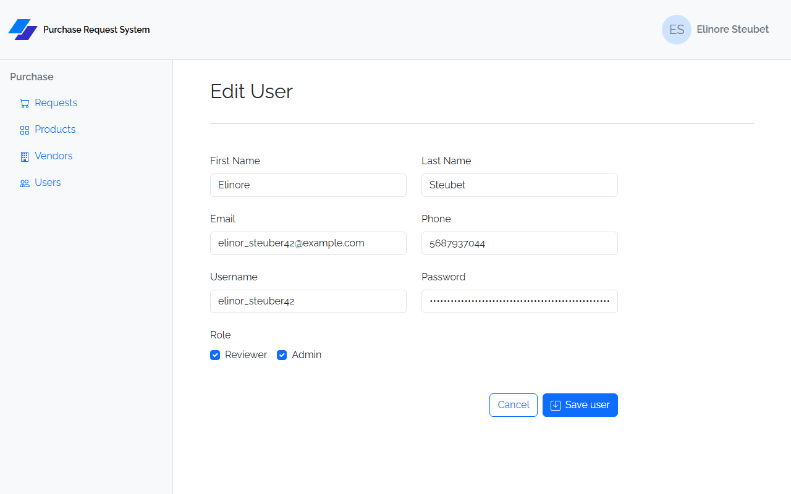

| Field | Input | Validation |
|---|---|---|
| First Name | text | Required |
| Last Name | text | Required |
| Email | email | Optional |
| Phone | text | Optional |
| Username | text | Required; max 50 characters |
| Password | password | Required; max 60 characters (bcrypt hash length) |
| Reviewer | checkbox | Optional; maps to `IsReviewer` |
| Admin | checkbox | Optional; maps to `IsAdmin` |

On save: navigates to `/users`.

---

## Static Design Project

The **HTML/CSS capstone** builds every PRS page above as **static HTML/CSS + Bootstrap** (the Vite scaffold from the HTML/CSS pass). The page layouts, fields, and buttons are exactly as described under **Frontend — Prs.Web** — use those as your visual target. Two things are specific to the static build:

- **Content is hardcoded** from the provided sample data — nothing is fetched. Each page shows realistic rows and values so it matches its reference screenshot.
- **Forms validate on submit** using a small shared script, `js/validation.js`, from **HTML/CSS Lesson 6**. Submitting an incomplete form reveals the error state — the same `is-invalid` + `.invalid-feedback` markup React's `react-hook-form` produces later, so the React capstone is a straight conversion.

### Wiring validation

Your PRS design starter does **not** include `js/validation.js` — create it (copy it from the Lesson 6 guide) and load it on every form page (`<script src="/js/validation.js">`). Then, on each form:

- Add `novalidate` and `data-success="/…"` (where a valid submit navigates) to the `<form>`.
- Add `required`, plus an `.invalid-feedback` message, to each required control.
- Add `min="1"` to Quantity, and native `maxlength="N"` where a length cap applies.
- Leave **disabled** controls (Requested By; Status on Create) and **optional** fields (Email, Phone) unvalidated.

`required` and `min` are checked on submit (the control turns red and its message appears); `maxlength` is a native attribute that simply blocks over-long input.

### Required validations

Every rule below must be implemented and visible on an empty/invalid submit. The messages match the React app so the static pages and the React capstone read identically.

| Page / Form | Field | Rule | Message |
|---|---|---|---|
| Sign In | Username | required | Username is required |
| Sign In | Password | required | Password is required |
| User Create / Edit | First Name | required | First name is required |
| User Create / Edit | Last Name | required | Last name is required |
| User Create / Edit | Username | required · `maxlength 50` | Username is required |
| User Create / Edit | Password | required · `maxlength 60` | Password is required |
| Vendor Create / Edit | Vendor Code | required · `maxlength 7` | Code is required |
| Vendor Create / Edit | Vendor Name | required | Name is required |
| Vendor Create / Edit | Address | required | Address is required |
| Vendor Create / Edit | City | required | City is required |
| Vendor Create / Edit | State | required | State is required |
| Vendor Create / Edit | Zip | required | Zip is required |
| Product Create / Edit | Product Number | required · `maxlength 20` | Number is required |
| Product Create / Edit | Product Name | required | Name is required |
| Product Create / Edit | Price | required | Price is required |
| Product Create / Edit | Unit | required | Unit is required |
| Product Create / Edit | Vendor | required | Vendor is required |
| Request Create / Edit | Description | required | Description is required |
| Request Create / Edit | Justification | required | Justification is required |
| Request Create / Edit | Delivery Method | required | Delivery method is required |
| Request Edit **only** | Status | required | Status is required |
| Request Line Create / Edit | Product | required | Product is required |
| Request Line Create / Edit | Quantity | `min 1` | Quantity must be at least 1 |
| Request Detail — Reject modal | Rejection Reason | required | Rejection reason is required |

> Fields not listed — Email, Phone, and the disabled Requested By and Create-page Status selects — are **not** validated.

Peer review of the static design compares each form's empty-submit error state against the reference screenshots.
